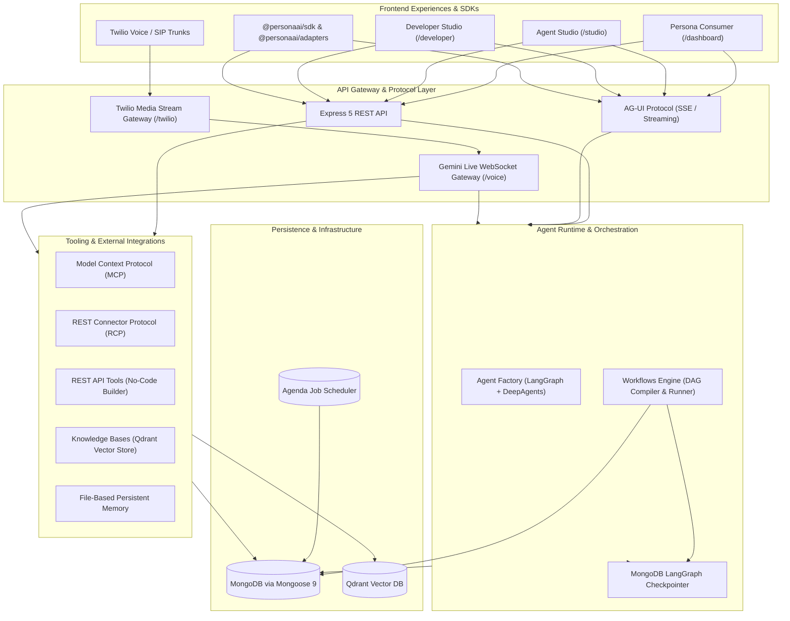
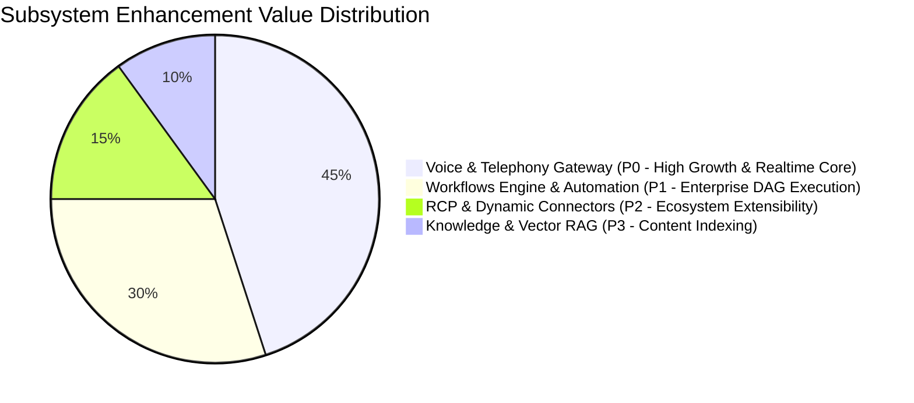

# Persona AI Platform: Architecture Inventory, Current State & Strategic Priorities

> **Document Version:** 1.0.0  
> **Date:** September 2026  
> **Repository:** `hasanraiyan/agent-marketplace`  
> **Scope:** Full-stack assessment (Backend, SDKs, Frontend, Protocols)

---

## 1. Executive Platform Architecture Overview

Persona is an enterprise-grade agent marketplace and autonomous execution platform operating under a **Three Frontends, One Shared Backend** architecture:

---

## 2. Comprehensive Module-by-Module Inventory

The backend (`agent-backend/src/modules/`) comprises 22 core modules partitioned across 6 foundational pillars:

### Pillar 1: Core Runtime & Execution
* **`agents`**: Agent graph compilation via `agent.factory.js`. Wraps LangGraph and DeepAgents, handles System Prompts, dynamic model instantiation (OpenAI, Anthropic, Gemini, DeepSeek), tool binding, HITL (`interruptOn`), and cross-provider message sanitization.
* **`agui`**: AG-UI SSE streaming protocol implementation (`runAgentAsAguiEvents`). Translates LangGraph run events into streaming events (`RUN_STARTED`, `TEXT_CHUNK`, `TOOL_CALL_STARTED`, `TOOL_CALL_RESULT`, `RUN_FINISHED`). Manages `turnContext` and subagent trace aggregation.
* **`sandbox`**: Code execution sandbox integration powered by CodeSandbox SDK (`@codesandbox/sdk`), supporting isolated runtime execution for developer code inspection.

### Pillar 2: Real-Time Voice & Telephony
* **`voice`**: Real-time bidirectional voice agent runtime using Gemini Live (`gemini-3.1-flash-live-preview`).
  - `voiceGateway.js`: Authenticates signed single-use voice tickets (`redeemVoiceTicket`) for both `ProjectAdmin` (Studio preview) and `ProjectRuntime` (end users).
  - `VoiceSession.js`: Bridges client WebSocket audio frames to Google Gemini Live API. Handles 16kHz PCM audio framing (`turnSeq`), barge-in/interruption detection, parallel tool execution with timeout aborts, and live `turnContext` parameter resolution.
  - `voiceTranscriptSink.js`: Fire-and-forget transcript accumulation persisted to conversation threads and LangGraph checkpoints.
* **`twilio`**: Telephony gateway bridging phone calls to `VoiceSession`.
  - `twilioGateway.js`: Handles WebSocket upgrades on `/api/v1/twilio/media-stream`. Resolves external users by caller phone number, manages thread continuity, seeds proactive greeting, and injects caller context (`callerPhone`, `callSid`).
  - `TwilioVoiceTransport.js`: Converts Twilio mulaw 8kHz audio packets to/from Gemini Live linear PCM 16kHz audio.

### Pillar 3: Tooling, Protocols & Connectors
* **`rcpSources`**: REST Connector Protocol integration (`rcp-sdk`). Dynamically discovers manifests from external endpoints at runtime. Maps dynamic per-turn parameters via `paramContextMap` (e.g. `userId`, `phone`) using `turnContext` without exposing them to the LLM.
* **`mcp`**: Model Context Protocol client (`@langchain/mcp-adapters`, `@modelcontextprotocol/sdk`). Supports HTTP and SSE transports, PKCE OAuth token refresh, API-key authentication, and schema loosening (`loosenSchema`) for robust LLM tool calling.
* **`restApiTools` & `restApiToolSources`**: No-code REST tool engine. Allows defining REST endpoints with templated paths, query params, headers, and body (`{{token}}`). Enforces reserved security tokens (e.g., `{{externalUserId}}`).
* **`skills`**: Custom prompt/instruction skills. Manages filesystem-based skill snippets (`/skills/` and `/skill-library/`) mounted into agent context.

### Pillar 4: Data, Knowledge & Memory
* **`knowledge`**: Retrieval-Augmented Generation (RAG). Integrates with Qdrant vector database (`@qdrant/js-client-rest`, `@langchain/qdrant`). Handles document uploads (PDF, TXT, MD), recursive text splitting, embedding generation, collection isolation, and semantic search tools (`search_knowledge_base`, `list_knowledge_base_sources`).
* **`memory`**: Persistent agent memory system backed by MongoDB-backed file store (`/memories/user/` and `/memories/agent/`). Survives process restarts and replaces ephemeral in-memory storage.
* **`stores`**: Project store mounts providing key-value and file-based state persistence with permission modes (`readonly`, `readwrite`).
* **`threads`**: Conversation threads and checkpoints. Persists chat sessions and LangGraph checkpoint tuples to MongoDB (`@langchain/langgraph-checkpoint-mongodb`).

### Pillar 5: Workflows & Multi-Agent Orchestration
* **`developer/workflows`**: Declarative Directed Acyclic Graph (DAG) orchestration engine built on LangGraph.
  - Supports 9 node types: `trigger`, `agentStep`, `knowledgeStep`, `toolStep`, `condition`, `approval`, `parallel`, `join`, `output`.
  - Handles versioning (`WorkflowVersion`), draft editing, live canvas visualization (`@xyflow/react`), Mermaid export, and dry-run execution with tool stripping.
  - Resilient execution with `WorkflowRunDriver` and orphan-run crash recovery (`recoverOrphanWorkflowRuns.job.js`).

### Pillar 6: Multi-Tenancy, Security & Platform
* **`projects`**: Tenant containers defining isolated namespaces (`domain`). Manages project members, API credentials, and AES-256-GCM encrypted secrets (`projectSecret.service.js`).
* **`auth`**: Clerk authentication middleware (`authMiddleware`) combined with Project Principal context builders (`ProjectAdminContext`, `ProjectRuntimeContext`, `ProjectMachineContext`).
* **`externalUsers`**: Anchors external end-user identities (`externalUserId`) to Projects, guaranteeing data isolation across multi-tenant applications.
* **`rateLimiter`**: Token bucket and concurrency limiting middleware (`rateLimiter.middleware.js`).
* **`jobs` & `cron`**: Agenda-based background job scheduler (`@agendajs/mongo-backend`) for periodic reconciliation and orphan cleanup.

---

## 3. Platform Status, Gaps & Production Readiness Matrix

| Pillar / Module | Status | Test Coverage | Key Strengths | Identified Gaps / Fragilities |
| :--- | :---: | :---: | :--- | :--- |
| **Voice & Telephony** (`voice`, `twilio`) | **Production-Ready (Beta)** | High (Unit + Gateway mocks) | Sub-second latency, Gemini Live real-time audio, Twilio bridging, tool calling with aborts, transcript checkpointing | Lack of audio jitter buffer on poor connections; no spoken interrupt approval for guarded tools (`interruptOn`); Twilio disconnect edge cases. |
| **Agent Runtime** (`agents`, `agui`) | **Production-Ready** | Very High | LangGraph integration, multi-provider sanitization, AG-UI streaming, subagent traces | Context window overflow protection relies on model truncation; large tool lists can bloat prompt tokens. |
| **Connectors** (`rcpSources`, `mcp`, `restApiTools`) | **Production-Ready** | High | Live manifest discovery, parameter resolution via `turnContext`, schema loosening | Unreachable upstream servers rely on timeouts (15s); need circuit-breaker caching for frequently failing endpoints. |
| **Workflows Engine** (`workflows`) | **Feature-Complete** | High | Resumable DAG execution, orphan run recovery, dry-run tool stripping, versioning | Credit metering formula is currently fixed/ad-hoc; direct MCP/RCP execution in raw ToolStep is deferred (runs via AgentStep). |
| **Knowledge & RAG** (`knowledge`) | **Production-Ready** | High | Multi-tenant Qdrant collections, PDF parsing, safe ownership checks | No hybrid search (BM25 + vector); large file batch uploads can lock single worker process during embedding generation. |
| **Tenancy & Security** (`projects`, `auth`, `secrets`) | **Battle-Tested** | Very High | AES-256-GCM encryption, strict domain separation, Clerk auth | Key rotation protocol requires manual database migration scripts. |

---

## 4. Priority Assessment: Where to Focus Next?

Based on architectural impact, business value, and technical depth, here are the top 3 high-priority subsystems that warrant formal **Functional & Non-Functional Requirements (FR/NFR)** specification and deep design:

### **Priority 1 (Recommended): Voice & Telephony Gateway (`voice` + `twilio`)**
* **Why this is #1:** Voice AI and telephony are the most latency-sensitive, complex real-time paths in the platform. A bug or delay in audio frames, tool execution, or connection drop directly degrades user experience.
* **Current Opportunity:**
  1. Formalize the bidirectional audio state machine (Connecting, Listening, Speaking, Interrupted, Tool-Calling, Terminated).
  2. Implement an adaptive jitter buffer and packet loss concealment for telephony.
  3. Design Spoken Approval / Human-in-the-Loop for guarded tools (`interruptOn`) over audio.
  4. Specify end-to-end resilience metrics: <800ms latency, automatic reconnection, graceful call teardown, and deterministic transcript persistence.

### **Priority 2: Workflows & Multi-Agent Orchestrator (`workflows`)**
* **Why this is #2:** Workflows enable long-running multi-agent business automation.
* **Current Opportunity:** Formalize the execution semantics of asynchronous human approval webhooks/emails, granular token-level credit metering, and circuit breaker policies for external steps.

### **Priority 3: RCP & Dynamic Enterprise Connectors (`rcpSources` + `mcp`)**
* **Why this is #3:** Powers third-party application integration and agent capabilities.
* **Current Opportunity:** Caching & health-checking daemon for external manifests, schema validation fallbacks, and multi-tenant OAuth token rotation.

---

## 5. Next Step Action Plan

We propose selecting **Voice & Telephony Gateway (`voice` / `twilio`)** as the target module to create a comprehensive specification document covering:
1. **Functional Requirements (FR):** Audio streaming lifecycle, Gemini Live protocol bridge, Twilio media stream translation, tool invocation semantics, dynamic `turnContext` resolvers, spoken HITL approval, transcript persistence.
2. **Non-Functional Requirements (NFR):** Latency SLAs (<800ms time-to-first-audio), audio frame integrity (16kHz PCM framing), network jitter resilience, concurrency limits, security & credential handling, and auditability.
3. **Architecture & Refactoring Plan:** Pinpointed enhancements to `VoiceSession.js`, `voiceGateway.js`, and `twilioGateway.js`.
