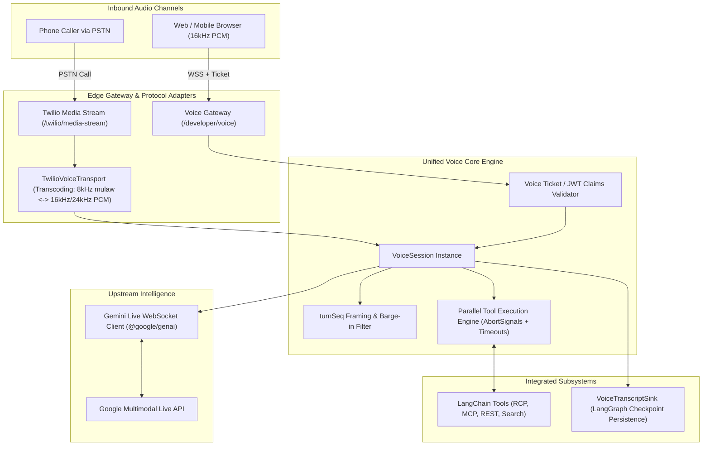
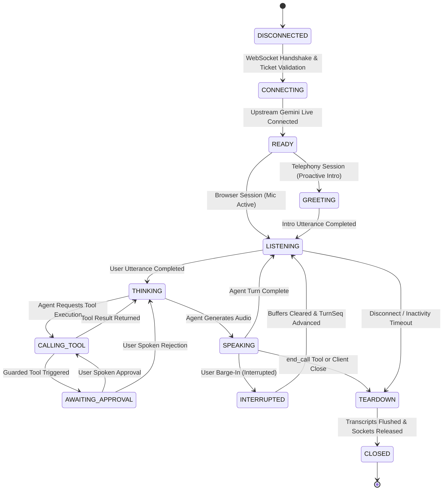

# Voice & Telephony Gateway: Comprehensive Functional & Non-Functional Specification

> **Module Targets:** `agent-backend/src/modules/voice/` & `agent-backend/src/modules/twilio/`  
> **Status:** Production Specification & Architecture Blueprint  
> **Date:** September 2026  
> **Authors:** Persona AI Engineering Team

---

## 1. System Overview & Mission Statement

The **Voice & Telephony Gateway** provides a unified, bidirectional, low-latency conversational audio runtime for the Persona AI Platform. It enables end users, browsers, and telephony callers to converse in real time with autonomous AI agents powered by Google Gemini Multimodal Live (`gemini-3.1-flash-live-preview`).

The system unifies two primary client access channels through a single core engine (`VoiceSession`):
1. **WebRTC / Direct WebSocket Clients:** Browser and mobile clients connecting directly via `/api/v1/developer/voice` or Developer Studio test playground using signed tickets.
2. **Telephony Audio Streams:** Public Switched Telephone Network (PSTN) calls arriving via Twilio Media Streams on `/api/v1/twilio/media-stream`.

---

## 2. Functional Requirements (FR)

### FR-1: Secure Session Initialization & Authentication
* **FR-1.1 (Browser / SDK Ticket Minting):** The API must provide an authenticated REST endpoint (`POST /api/v1/developer/voice/sessions` or `POST /api/v1/projects/:projectId/voice/sessions`) that validates project credentials or Clerk admin sessions and mints a single-use HMAC-SHA256 signed JWT ticket with a 60-second TTL.
* **FR-1.2 (Ticket Verification at Edge):** The WebSocket server must validate ticket signature, expiration, and replay prevention during WebSocket upgrade handshake. Replayed or forged tickets must be rejected with HTTP `401 Unauthorized`.
* **FR-1.3 (Telephony Caller Identification):** Telephony connections via Twilio Media Streams must parse inbound parameters (`streamSid`, `callSid`, `callerPhone`, `agentId`, `projectId`), anchor the caller to an `ExternalUser` record, and verify project credentials.

### FR-2: Bidirectional Audio Streaming & Transcoding
* **FR-2.1 (Browser Audio Profile):** Web clients must stream raw linear PCM 16-bit, 16kHz, mono audio packets over binary WebSocket frames.
* **FR-2.2 (Telephony Audio Transcoding):** Telephony streams must transcode 8kHz mu-law audio packets from Twilio into 16kHz linear PCM16 for Gemini Live ingestion. Outbound audio from Gemini (24kHz PCM16) must be downsampled and companded into 8kHz mu-law with 20ms pacing (160 bytes per packet).
* **FR-2.3 (Audio Framing & Sequence Tracking):** Outbound audio sent to client sockets must be framed with a 4-byte little-endian unsigned integer `turnSeq` header prepended to the raw PCM buffer:
  `[ 4-byte turnSeq (LE) ] [ PCM16 Audio Payload ]`.

### FR-3: Upstream Gemini Multimodal Live Connection
* **FR-3.1 (Session Setup):** `VoiceSession` must establish a WebSocket connection to the Gemini Live endpoint (`gemini-3.1-flash-live-preview`) using the decrypted provider API key.
* **FR-3.2 (Initial Configuration):** On connect, the session must send a `LiveConnectConfig` payload containing:
  - System Instructions (combining Agent System Prompt, Seed Excerpt, and optional Turn Context Override).
  - Voice Name (e.g. `Puck`, `Aoede`, `Charon`, `Kore`, `Fenrir`).
  - Generation Configuration (temperature, response modalities `["AUDIO"]`).
  - Sanitized Tool Function Declarations.
* **FR-3.3 (Session Resumption):** If the upstream connection drops mid-call, `VoiceSession` must seamlessly reconnect using the Gemini session resumption handle without terminating the user's call.

### FR-4: Real-Time Barge-In & Interruption Handling
* **FR-4.1 (Interruption Detection):** Gemini Live signals `interrupted: true` when caller speech overlaps with agent speech.
* **FR-4.2 (Turn Sequence Invalidation):** Upon barge-in, `VoiceSession` increments `acceptedTurnSeq`, immediately discards any queued agent audio frames with `turnSeq < acceptedTurnSeq`, and broadcasts a `voice_interrupted` AG-UI control event.
* **FR-4.3 (Telephony Buffer Clear):** In telephony calls, `TwilioVoiceTransport` must immediately clear its local pacing queue and send a Twilio `clear` media event (`{"event": "clear", "streamSid": "..."}`) to flush the telephone earphone buffer.

### FR-5: Asynchronous Tool Execution with Abort Protection
* **FR-5.1 (Tool Dispatch):** When Gemini Live emits a `toolCall` message containing one or more function calls, `VoiceSession` must execute them concurrently using the underlying LangChain tools.
* **FR-5.2 (Execution Timeout):** Every tool invocation must be governed by an `AbortController` and a strict timeout (maximum 15,000ms). If a tool times out, the controller aborts and returns an error response object.
* **FR-5.3 (Cancellation Propagation):** If Gemini emits a `toolCallCancellation` (e.g. due to user interruption while a tool is computing), `VoiceSession` marks the call as cancelled and suppresses the result from being sent back.
* **FR-5.4 (Batch Response Synchronization):** `VoiceSession` must reply to Gemini Live with a single atomic `sendToolResponse` batch containing results for all declared function calls.

### FR-6: Dynamic `turnContext` Resolution & Live Mutation
* **FR-6.1 (Context Seed):** `VoiceSession` must seed its `turnContext` from the initial ticket claims or telephony metadata (`callerPhone`, `callSid`).
* **FR-6.2 (Live Context Refresh):** The client may send `{"type": "voice.context", "context": { ... }}` at any point during an active call to update session context without disconnecting.
* **FR-6.3 (Tool Injection):** When tools are executed, `turnContext` must be passed via `config.configurable.turnContext` so that dynamic parameter resolvers (e.g. in RCP sources) can resolve parameters without LLM prompting.

### FR-7: Guarded Tools & Spoken Human-In-The-Loop (HITL)
* **FR-7.1 (Guarded Tool Inspection):** Agents with `interruptOn` configured for critical tools must enforce verbal confirmation before execution.
* **FR-7.2 (Spoken Approval Flow):** When a guarded tool is selected by the model, the session enters `AWAITING_SPOKEN_APPROVAL`, prompting the user for verbal consent ("Do you confirm executing X with parameters Y?").

### FR-8: Transcript Persistence & Checkpointing
* **FR-8.1 (Transcript Streaming):** Live transcript deltas (both user and agent) must be parsed from Gemini `serverContent` parts and emitted to the client via `voice_transcript` events.
* **FR-8.2 (Thread Checkpointing):** For `ProjectRuntime` and telephony sessions, finalized transcript turns must be committed via `VoiceTranscriptSink` into the thread's checkpoint in MongoDB. Persistence failures must be fire-and-forget and must never degrade audio quality or latency.

### FR-9: Telephony Proactive Greeting & Call Teardown
* **FR-9.1 (Proactive Initial Greeting):** On telephony connection, once Gemini signals session ready, `TwilioVoiceTransport` must automatically emit a synthetic prompt instructing the agent to greet the caller warmly.
* **FR-9.2 (Graceful Teardown):** When the agent or caller invokes `end_call` or closes the connection, the transport must allow a 800ms audio drain window before severing the WebSocket and releasing PSTN channels.

---

## 3. Non-Functional Requirements (NFR)

### NFR-1: Latency & Performance SLAs
* **NFR-1.1 (Time-to-First-Audio - TTFA):** From caller utterance completion to first audio packet emission, latency must be **<800ms** under normal network conditions.
* **NFR-1.2 (Tool Execution Latency):** Tool executions must complete within **<1,500ms** (excluding upstream network latency) and hard-timeout at **15,000ms**.
* **NFR-1.3 (Interruption Reaction Time):** Local buffer flush and Twilio `clear` emission on barge-in must occur within **<50ms** of receiving the interruption signal.

### NFR-2: Audio Fidelity & Codec Integrity
* **NFR-2.1 (Sampling Integrity):** Transcoding between G.711 mu-law (8kHz) and linear PCM (16kHz / 24kHz) must utilize anti-aliasing interpolation filters to prevent harmonic distortion.
* **NFR-2.2 (Pacing Stability):** Telephony audio must be paced at exactly **20ms ± 2ms** intervals (160 bytes @ 8kHz) to eliminate audio clipping or buffer underruns on PSTN trunks.

### NFR-3: Concurrency & Scalability
* **NFR-3.1 (Concurrent Sessions):** A single Node.js instance (4 vCPU, 8GB RAM) must sustain a minimum of **150 concurrent bidirectional voice sessions** without exceeding 70% CPU utilization.
* **NFR-3.2 (Memory Footprint):** Memory consumption per active `VoiceSession` must not exceed **25MB**, with all audio frame buffers released immediately upon transmission.

### NFR-4: High Availability & Fault Tolerance
* **NFR-4.1 (Graceful Upstream Failure):** If Gemini Multimodal Live API returns an error or socket closes abnormally, `VoiceSession` must log diagnostic context, notify the client with a user-friendly error event, and gracefully terminate without process crash.
* **NFR-4.2 (Sink Isolation):** MongoDB checkpoint failures or database latency spikes must not stall the audio processing loop.

### NFR-5: Multi-Tenancy & Data Security
* **NFR-5.1 (Domain Isolation):** Voice sessions must strictly operate within the validated `domain` (Project ID). No tool or resource belonging to another Project may be accessed.
* **NFR-5.2 (Credential Protection):** Decrypted API keys and project secrets must exist only in ephemeral process memory for the duration of the call and must NEVER be logged, persisted, or returned in WebSocket messages.
* **NFR-5.3 (Zero Audio Retention):** Raw audio buffers must never be persisted to disk or database. Only transcribed text is committed to conversation checkpoints.

### NFR-6: Observability & Telemetry
* **NFR-6.1 (Structured Diagnostic Logging):** Every voice session must log structured events: session start, tool invocations, packet count milestones, barge-ins, and session closure reasons (`durationMs`, `reason`).
* **NFR-6.2 (Audit Trail):** Tool execution calls must log metadata (tool name, execution duration, status code) without logging raw payloads or personal identifiable information (PII).

---

## 4. Voice Session State Machine

---

## 5. Architectural Improvements & Refactoring Plan

Based on the requirements above, the following refactoring roadmap is executed across the voice and telephony subsystems:

1. **Jitter & Outbound Buffer Management (`TwilioVoiceTransport.js`):**
   - Introduce an adaptive buffer watermark (max 200 chunks / 4 seconds of audio) to prevent runaway memory usage if Twilio socket experiences backpressure.
   - Guard against invalid turnSeq regressions.
2. **Audio Frame Heartbeat & Dead Socket Detection (`VoiceSession.js`):**
   - Add ping/pong keepalive every 30 seconds to terminate orphaned sessions when clients drop without clean TCP close.
3. **Structured Tool Response Sanitization:**
   - Enforce that tool results returned to Gemini Live always conform to `{ response: { output: string | object } }`.
4. **Clean Shutdown & PSTN Release (`twilioGateway.js`):**
   - Ensure `TwilioVoiceTransport` releases stream handles on close and triggers external user session termination.
