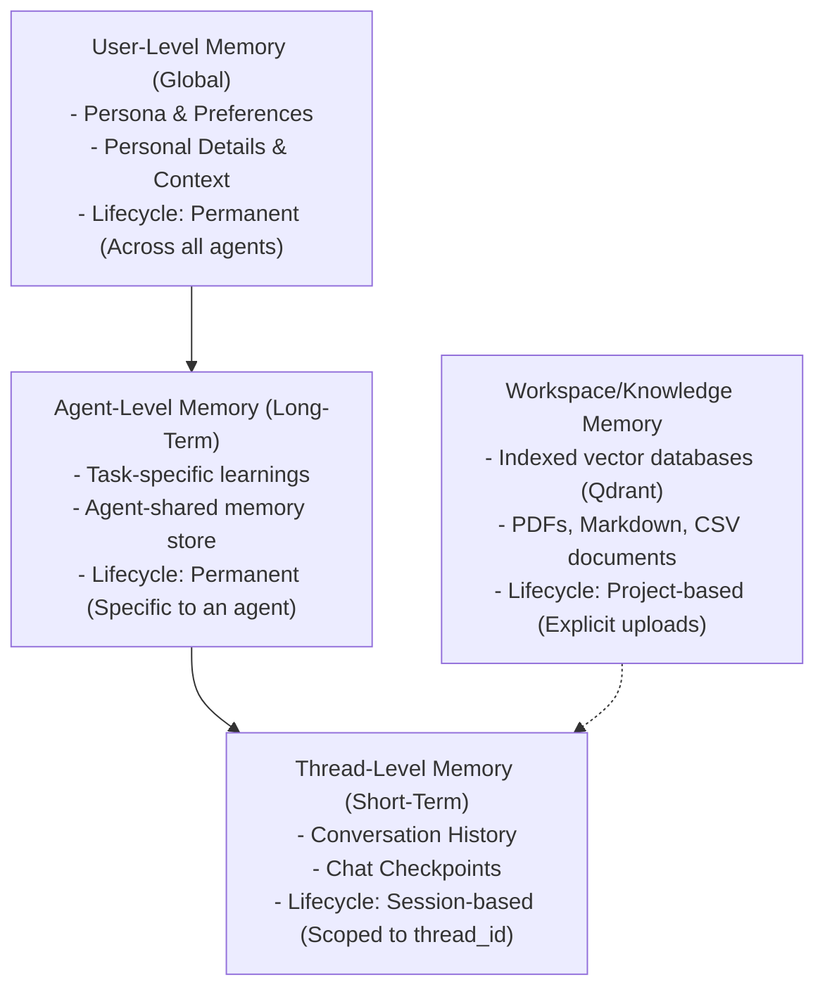
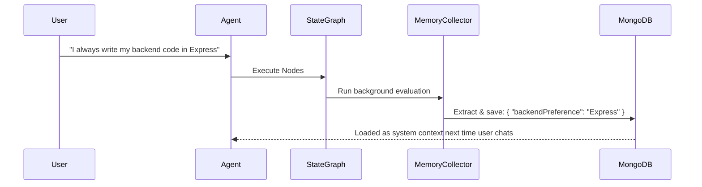

# AI Agent Memory Systems: Architectural Research and Design

AI memory is the capability of an agent system to store, retrieve, recall, and update context, facts, and conversation history across different time horizons and interactions. Without a well-designed memory layer, AI agents remain stateless transaction engines, forgetting who the user is and what they learned in previous steps.

This document details the conceptual levels of AI memory and outlines the architectural mappings to the **Agent-Marketplace** stack.

---

## 1. Multi-Level Memory Taxonomy

To design a robust AI system, we must classify memory by its scope, lifecycle, and target:



### A. User-Level Memory (Global Memory)
*   **What it is:** Information *about* the user that spans all agents, conversations, and workspaces.
*   **Examples:** The user's name, coding style preferences (e.g., "prefer ES6 modules", "likes functional React"), time zone, organizational context, and past feedback.
*   **Lifecycle:** Permanent. Persists globally for the user's account.
*   **How it works:** Typically managed via a background summarizer agent (a "Memory Collector") that monitors chat threads for personal disclosures, updating a centralized JSON profile or embedding database.

### B. Agent-Level Memory (Long-Term Learning)
*   **What it is:** Learnings and preferences belonging to a *specific agent* across different users or different threads.
*   **Examples:** A customer support agent remembering common issues it resolved previously, or a coding agent saving a custom utility function it created in a previous session to reuse later.
*   **Lifecycle:** Permanent. Tied to the lifespan of the specific agent instance.
*   **How it works:** Backed by a document store or key-value store (e.g. LangGraph's `Store` class) where the agent can save key-value pairs representing custom states, templates, or instructions.

### C. Session/Thread-Level Memory (Short-Term Checkpointing)
*   **What it is:** The actual message-by-message dialog and graph execution state within a single conversation.
*   **Examples:** The sequence of messages, tool outputs, and execution states (e.g. step indices, human-in-the-loop approvals).
*   **Lifecycle:** Scoped to a specific `thread_id`. It is active during a conversation and is archived/loaded whenever the user opens/closes that chat tab.
*   **How it works:** Backed by database checkpointers (e.g., LangGraph's `BaseCheckpointSaver`), which save a serialization of the entire graph state after each node execution.

### D. Workspace & RAG Memory (Knowledge Bases)
*   **What it is:** Semantic search databases containing files, articles, and specific codebases.
*   **Examples:** The `SOFTWARE_ENGINEERING_Study_Guide.pdf` file uploaded to a Knowledge Base and indexed as vectors in Qdrant.
*   **Lifecycle:** Project-scoped. Managed explicitly by creating, updating, or deleting files.
*   **How it works:** Documents are split into chunks, transformed into vector embeddings via an embedding model (like OpenAI's `text-embedding-3-small`), and queried via similarity search.

---

## 2. Current Implementation Analysis in `agent-marketplace`

By inspecting the codebase, we can map how these memory layers are implemented today:

| Memory Level | Technology Used | Code Reference | Persistence Status |
| :--- | :--- | :--- | :--- |
| **Short-Term (Thread)** | `MongoDBSaver` (LangGraph) | [checkpoint.service.js](file:///D:/projects/agent-marketplace/agent-backend/src/services/checkpoint.service.js#L11-L15) | **Persistent** (stored in `checkpoints` & `checkpoint_writes` collections) |
| **Long-Term (Agent)** | `InMemoryStore` (LangGraph) | [agentFactory.js](file:///D:/projects/agent-marketplace/agent-backend/src/factories/agentFactory.js#L17) | **Ephemeral** (clears when the node process restarts) |
| **Knowledge (RAG)** | Qdrant (Cloud) + MongoDB | [knowledge.service.js](file:///D:/projects/agent-marketplace/agent-backend/src/services/knowledge.service.js) | **Persistent** (vectors in Qdrant, chunk indices in MongoDB) |
| **User Profile (Global)** | MongoDB (`User` schema) | [User.js](file:///D:/projects/agent-marketplace/agent-backend/src/models/User.js) | **Semi-Static** (updated manually via profile settings, not dynamically learned) |

### Thread-Level Memory Details
The short-term memory is robustly handled using a MongoDB-backed LangGraph checkpointer. When a user opens a thread:
1. `checkpointService.getMessages(threadId)` fetches the serialized state tuple from the `checkpoints` collection.
2. The agent is built with this checkpointer configuration.
3. Every message append or state change automatically serializes the graph state back to MongoDB.

### The Long-Term Memory Limitation
In [agentFactory.js](file:///D:/projects/agent-marketplace/agent-backend/src/factories/agentFactory.js#L17), the long-term `store` is instantiated as:
```javascript
const globalStore = new InMemoryStore();
```
> [!WARNING]
> Because `InMemoryStore` stores data in the server's RAM, **all long-term agent memories and learnings are lost whenever the server restarts** (e.g. during deployments or when nodemon restarts during development).

---

## 3. Blueprint for Production-Grade Memory

To move this system to a state-of-the-art production architecture, we can implement the following enhancements:

### A. Persist the Long-Term Agent Store
Replace the ephemeral `InMemoryStore` with a database-backed store (like a MongoDB-backed `Store`). This allows agents to write custom states that survive process restarts.

For example, when LangGraph releases a formal `MongoDBStore`, or by writing a custom provider:
```javascript
// Blueprint for persistent Agent Store
import { MongoDBStore } from "./utils/mongoStore.js"; // custom database store
const globalStore = new MongoDBStore({ client: mongoClient });
```

### B. Implement Dynamic "Memory Collector" Agent
Instead of a static user profile, introduce a background task or conditional graph node that checks user inputs for long-term facts (e.g., "I use React with functional components") and saves them to the user's global profile.



### C. Episodic Memory Retrieval (Past Conversation Search)
Instead of loading the entire chat history (which wastes tokens and hits context limits), use vector search to query *past conversations* that are semantically relevant to the current question:

1. Every time a thread is closed or archived, serialize and embed the conversation summary.
2. When the user asks a question, run a vector similarity search over their *entire conversation history*.
3. Inject the top 2-3 matching past conversations as "episodes" into the prompt.
