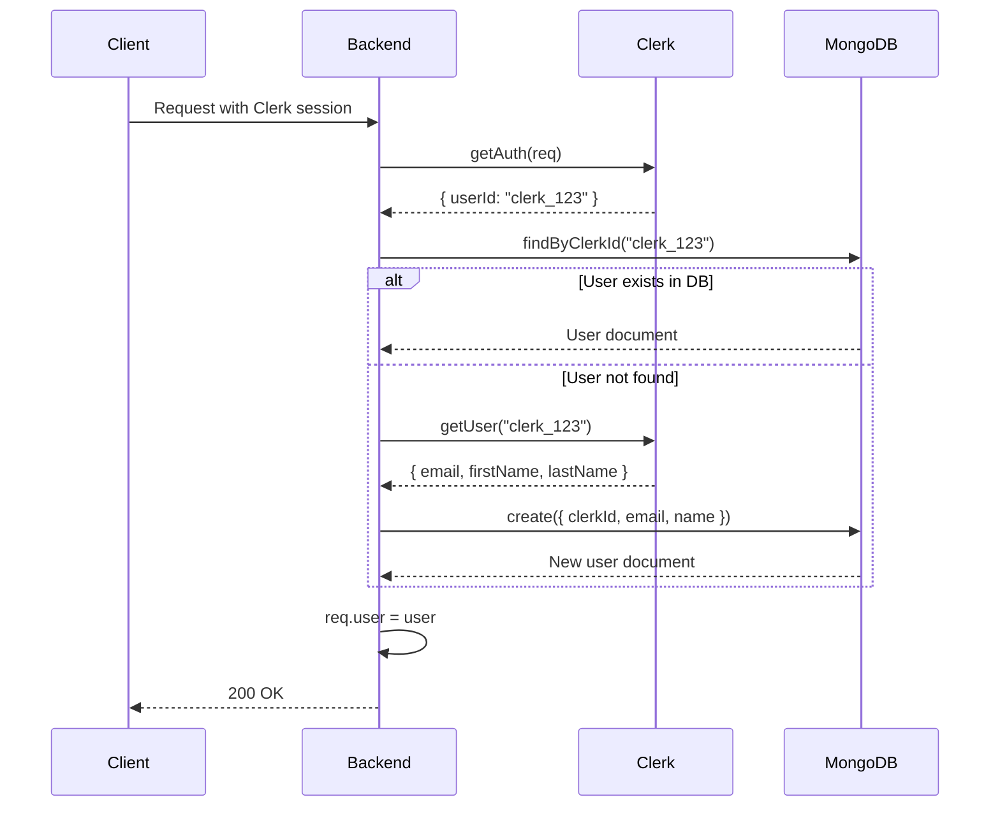

# Authentication

## Overview

Authentication is handled by **Clerk**, an external authentication provider. The backend does not manage passwords, tokens, or sessions directly — it relies on Clerk's session management.

## How It Works

1. **Client authenticates with Clerk** — The frontend uses Clerk's SDK to handle login, signup, and session management
2. **Clerk issues a session** — The session is stored in a `__session` cookie or can be passed as a Bearer token
3. **Backend verifies the session** — The `authMiddleware` uses `@clerk/express` `getAuth()` to extract the Clerk user ID
4. **User is synced to local DB** — On first authentication, the user is auto-created in MongoDB

## Auth Middleware Levels

### Required Auth (`authMiddleware`)

Used for endpoints that strictly require authentication.

```javascript
import authMiddleware from '../modules/auth/auth.middleware.js';

// All routes below this require auth
router.use(authMiddleware);

// Per-route
router.post('/', authMiddleware, controller.create);
```

When authentication fails, returns:

```json
{
  "statusCode": 401,
  "message": "Access token required",
  "code": "UNAUTHORIZED"
}
```

### Optional Auth (`optionalAuthMiddleware`)

Used for endpoints that work for both authenticated and unauthenticated users.

```javascript
import optionalAuthMiddleware from '../modules/auth/optional-auth.middleware.js';

router.post('/search', optionalAuthMiddleware, controller.search);
```

When authenticated, `req.user` is set. When unauthenticated, the request proceeds without `req.user`.

### Admin Auth (`adminMiddleware`)

Used for admin-only endpoints. Must be used after `authMiddleware`.

```javascript
import authMiddleware from '../modules/auth/auth.middleware.js';
import adminMiddleware from '../modules/users/admin.middleware.js';

router.get('/users', authMiddleware, adminMiddleware, adminController.listUsers);
```

When the user is not an admin, returns:

```json
{
  "statusCode": 403,
  "message": "Admin access required",
  "code": "FORBIDDEN"
}
```

## Webhook Verification

Clerk webhook events are verified using **Svix** signature verification, not Clerk middleware.

## Session Token Format

The backend accepts Clerk session tokens in one of two ways:

1. **Cookie** — `__session` cookie (handled automatically by `@clerk/express`)
2. **Authorization Header** — `Authorization: Bearer <session_token>`

## User Sync Flow



## Webhook-Based Sync

For lifecycle events (user creation, update, deletion), Clerk sends webhooks to:

```
POST /api/v1/webhooks/clerk
```

These are verified with Svix signatures and keep the local MongoDB in sync. See [Webhooks Module](../modules/webhooks.md) for details.
