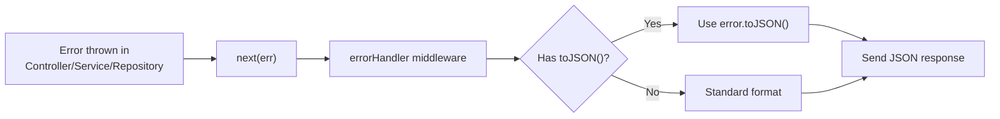

# Error Handling

## Error Response Format

All errors follow a consistent format:

```json
{
  "success": false,
  "status": "error",
  "statusCode": 400,
  "message": "Human-readable error description",
  "code": "ERROR_CODE",
  "timestamp": "2026-07-20T12:00:00.000Z"
}
```

For validation errors, additional details are included:

```json
{
  "success": false,
  "status": "error",
  "statusCode": 400,
  "message": "Validation failed",
  "code": "VALIDATION_ERROR",
  "details": {
    "errors": [
      {
        "field": "email",
        "message": "Invalid email format",
        "code": "invalid_string"
      }
    ]
  },
  "timestamp": "2026-07-20T12:00:00.000Z"
}
```

## Error Classes

| Class             | Status Code | Error Code         | When Used                        |
| ----------------- | ----------- | ------------------ | -------------------------------- |
| `BaseError`       | 500         | `INTERNAL_ERROR`   | Base class for all custom errors |
| `ValidationError` | 400         | `VALIDATION_ERROR` | Request validation failures      |
| `NotFoundError`   | 404         | `NOT_FOUND`        | Resource not found               |
| `RateLimitError`  | 429         | `RATE_LIMIT_ERROR` | Rate limit exceeded              |
| `BaseError`       | 401         | `UNAUTHORIZED`     | Authentication required          |
| `BaseError`       | 403         | `FORBIDDEN`        | Insufficient permissions         |

## Error Codes

| Code               | Status | Description                                     |
| ------------------ | ------ | ----------------------------------------------- |
| `VALIDATION_ERROR` | 400    | Request body/query/params failed Zod validation |
| `UNAUTHORIZED`     | 401    | No valid authentication token                   |
| `FORBIDDEN`        | 403    | Authenticated but insufficient permissions      |
| `NOT_FOUND`        | 404    | Requested resource does not exist               |
| `CONFLICT`         | 409    | Resource conflict (e.g., duplicate slug)        |
| `RATE_LIMIT_ERROR` | 429    | Too many requests                               |
| `INTERNAL_ERROR`   | 500    | Unexpected server error                         |

## HTTP Status Codes

| Code | Description                          |
| ---- | ------------------------------------ |
| 200  | Success                              |
| 201  | Created                              |
| 400  | Bad Request (validation error)       |
| 401  | Unauthorized (no/invalid auth token) |
| 403  | Forbidden (insufficient permissions) |
| 404  | Not Found                            |
| 409  | Conflict                             |
| 429  | Rate Limited                         |
| 500  | Internal Server Error                |

## Error Handling Flow



## Global Error Handler

The global error handler at `src/middlewares/errorHandler.js`:

1. Logs the error with details (path, method, status code)
2. Determines status code from `err.statusCode` (defaults to 500)
3. Formats response using `errorFormatter`
4. Sends formatted JSON response

## Throwing Errors in Services

```javascript
import { NotFoundError, ValidationError } from '../../utils/errors/index.js';

// Resource not found
throw new NotFoundError('Agent not found');

// Validation failure
throw new ValidationError('Invalid configuration', {
  errors: [{ field: 'name', message: 'Name is required' }],
});

// Generic error
throw new BaseError('Operation failed', 400, 'CONFLICT');
```
