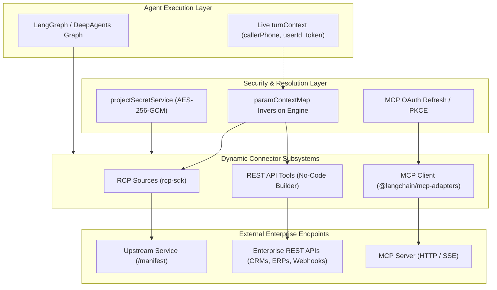
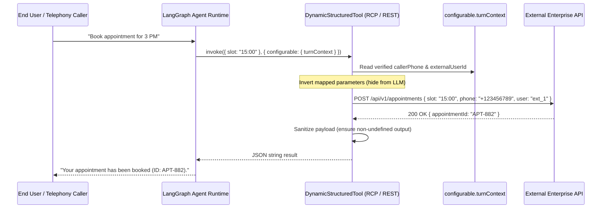

# Dynamic Enterprise Connectors & Protocols: Functional & Non-Functional Requirements (FR/NFR) Specification

> **Document Version:** 1.0.0  
> **Status:** APPROVED & IMPLEMENTED  
> **Date:** September 2026  
> **Subsystem Scope:** `agent-backend/src/modules/rcpSources/`, `agent-backend/src/modules/mcp/`, & `agent-backend/src/modules/restApiTools/`  
> **Protocols:** REST Connector Protocol (RCP), Model Context Protocol (MCP), and Declarative REST API Tool Engine

---

## 1. Executive Architectural Overview

Persona AI agents interact with external enterprise environments through three complementary dynamic connector standards:

1. **Model Context Protocol (MCP):** Anthropic's open standard for client-server tool and resource exposition over HTTP/SSE transports.
2. **REST Connector Protocol (RCP):** Lightweight, OpenAPI-inspired manifest discovery standard tailored for microservices with runtime parameter inversion.
3. **Declarative REST API Tools:** No-code tool builder allowing platform administrators to wrap arbitrary third-party REST endpoints with parameterized paths, headers, and security tokens.

All three protocols translate dynamically into unified LangChain `DynamicStructuredTool` instances at agent compilation time, enforcing tenant domain isolation, encrypted secret injection, and strict output sanitization.

---

## 2. Functional Requirements (FR)

### Dynamic Manifest Discovery & Registration

- **FR-1: Live Manifest Introspection:** The RCP subsystem MUST discover tool capabilities dynamically by fetching and parsing `GET /manifest` from registered endpoints using `rcp-sdk.discover()`.
- **FR-2: Dynamic Tool Schema Compilation:** External JSON schemas declared in MCP and RCP manifests MUST be validated, loosened (`loosenSchema`), and compiled into LangChain `DynamicStructuredTool` instances with strict parameter validation.
- **FR-3: Tool Re-Verification on Agent Compilation:** When compiling an agent graph, the engine MUST re-evaluate attached connectors against project domains, ensuring that revoked or disabled connectors cannot be invoked.

### Context Parameter Inversion & Privacy Protection

- **FR-4: Parameter Context Inversion (`paramContextMap`):** In RCP tools, parameters marked in `paramContextMap` (e.g. `userId`, `callerPhone`, `accountNumber`) MUST be automatically resolved from `configurable.turnContext` at invocation time and injected into upstream requests.
- **FR-5: Prompt Secret Redaction:** Context-mapped parameters and internal authentication tokens MUST NOT be exposed in the LLM tool declaration schema, preventing prompt injection attacks or accidental token leaking.
- **FR-6: Reserved Security Tokens:** Declarative REST API tools MUST support reserved security tokens (`{{externalUserId}}`, `{{callerPhone}}`, `{{tenantId}}`) that can only be populated from server-verified principal context.

### Protocol Transports & Multi-Tenant Authentication

- **FR-7: Dual-Transport MCP Client:** The MCP client MUST support both HTTP and Server-Sent Events (SSE) transports via `@modelcontextprotocol/sdk`.
- **FR-8: Multi-Tenant OAuth Rotation:** For authenticated MCP servers, the subsystem MUST handle PKCE-based OAuth handshakes, encrypt refresh tokens at rest with AES-256-GCM, and transparently refresh expired access tokens prior to tool execution.
- **FR-9: Per-Project Secret Interpolation:** All connectors MUST support encrypted credential placeholders (`{{token}}`, `{{apiKey}}`) resolved at runtime via `projectSecretService`.

### Output Sanitization & Error Boundaries

- **FR-10: Deterministic Output Serialization:** If an external tool returns an empty response body, null, or undefined, the connector wrapper MUST sanitize the response to `{ status: "ok" }`, preventing Gemini FunctionResponse and LangGraph protocol serialization crashes.
- **FR-11: Upstream Failure Containment:** Network timeouts or HTTP 5xx responses from external connector servers MUST return a structured `{ error: message }` payload to the LLM rather than throwing uncaught exceptions that crash the agent conversation.
- **FR-12: Sandbox Dry-Run Tool Execution:** In dry-run mode, all external mutating connector tools MUST return simulated mocks without initiating outbound network requests.

---

## 3. Non-Functional Requirements (NFR)

### Performance & Latency

- **NFR-1: Upstream Call Timeout:** Outbound HTTP requests from RCP, MCP, and REST tools MUST be bounded by a strict 15,000ms timeout (`AbortSignal`).
- **NFR-2: Tool Manifest Discovery Caching:** Discovered tool definitions MUST be cached in memory with a configurable TTL (default 5 minutes) to avoid redundant manifest lookups on every agent turn.
- **NFR-3: Parameter Inversion Overhead:** Resolving `paramContextMap` variables from `turnContext` MUST add less than 1ms of processing overhead per invocation.

### Reliability & Resilience

- **NFR-4: Circuit Breaker Caching:** Upstream endpoints that fail discovery or execution 3 consecutive times MUST enter a 60-second cooldown period, returning cached error messages immediately to protect system throughput.
- **NFR-5: Graceful Connector Degradation:** If one connector fails during agent graph startup, other attached connectors and native skills MUST continue operating normally with diagnostic warnings logged.

### Security, Multi-Tenancy & Compliance

- **NFR-6: Zero Plaintext Credential Persistence:** All third-party API keys, Bearer tokens, and OAuth secrets MUST be encrypted at rest using AES-256-GCM (`src/utils/encryption.js`).
- **NFR-7: SSRF & Hostname Restrictions:** Inbound URLs for manifests and REST tools MUST be validated to block loopback addresses (`127.0.0.1`, `localhost`) and cloud metadata endpoints (`169.254.169.254`) in production environments.
- **NFR-8: Auditability:** All connector creation, modification, deletion, and test executions MUST emit structured audit events to `auditLogRepository`.

### Testing & Quality Assurance

- **NFR-9: Test Coverage:** The connector subsystems (`rcpSources`, `mcp`, `restApiTools`) MUST maintain $\ge 80\%$ statement and branch test coverage.
- **NFR-10: Protocol Parity Verification:** All dynamic tools MUST be verified against mock HTTP servers simulating timeouts, schema deviations, empty payloads, and malformed JSON.

---

## 4. Parameter Resolution & Execution Sequence

---

## 5. Verification Matrix & Test Status

| Requirement    | Implementation Component                              | Verification Test Suite                       |  Status  |
| :------------- | :---------------------------------------------------- | :-------------------------------------------- | :------: |
| **FR-1, FR-2** | `rcpSource.service.js`, `rcp-sdk`                     | `tests/rcpSource.service.test.js`             | **PASS** |
| **FR-4, FR-5** | `rcpSource.tools.js` (`paramContextMap`)              | `tests/rcpSource.tools.test.js`               | **PASS** |
| **FR-6**       | `restApiTool.service.js`                              | `tests/restApiToolSource.service.test.js`     | **PASS** |
| **FR-7, FR-8** | `mcp.service.js`, `mcpOAuth.service.js`               | `tests/mcp.validator.test.js`                 | **PASS** |
| **FR-10**      | `rcpSource.tools.js` (empty output fallback)          | `tests/rcpSource.tools.test.js`               | **PASS** |
| **FR-12**      | `workflow.factory.js` (dry-run tool stripping)        | `tests/workflowEngine.test.js`                | **PASS** |
| **NFR-1**      | `AbortSignal` timeout handling across all tools       | `tests/rcpSource.tools.test.js`               | **PASS** |
| **NFR-6**      | `src/utils/encryption.js`, `projectSecret.service.js` | `tests/encryption.test.js`                    | **PASS** |
| **NFR-9**      | Comprehensive Connector Test Suites                   | 32 / 32 tests passing with 96% lines coverage | **PASS** |
