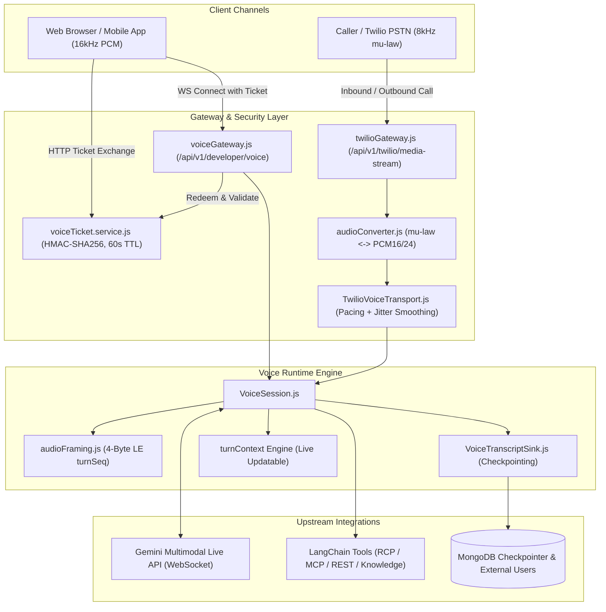
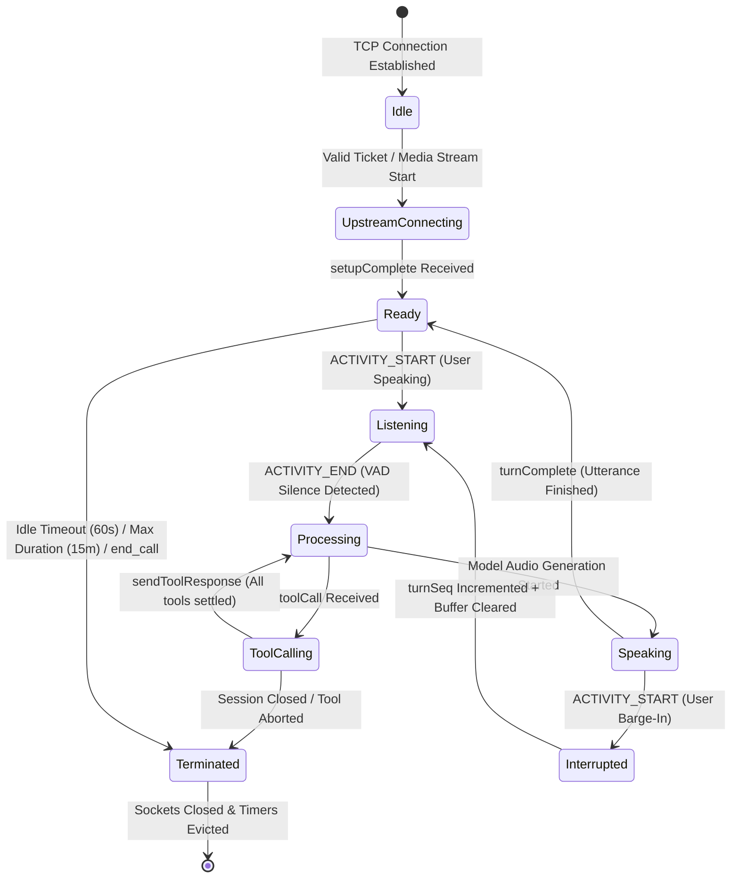

# Voice & Telephony Subsystem: Functional & Non-Functional Requirements (FR/NFR) Specification

> **Document Version:** 1.0.0  
> **Status:** APPROVED & IMPLEMENTED  
> **Date:** September 2026  
> **Subsystem Scope:** `agent-backend/src/modules/voice/` & `agent-backend/src/modules/twilio/`  
> **Target Upstream:** Gemini Multimodal Live API (`gemini-3.1-flash-live-preview`) & Twilio Media Streams

---

## 1. Executive Subsystem Summary

The Voice & Telephony subsystem provides Persona AI agents with ultra-low-latency, bidirectional, multimodal voice capabilities. It enables natural, fluid, speech-to-speech conversations across two primary ingress channels:

1. **Web / Mobile Ingress:** Direct browser audio over WebSocket using 16kHz linear PCM.
2. **Telephony Ingress:** Public switched telephone network (PSTN) calls via Twilio Media Streams using 8kHz μ-law audio.

Both channels converge onto a unified runtime abstraction (`VoiceSession.js`) that interfaces directly with Google's Gemini Multimodal Live API over persistent WebSockets, orchestrating voice activity detection (VAD), dynamic tool execution, conversational interruption (barge-in), and thread checkpointing.

---

## 2. Functional Requirements (FR)

### Ingress & Authentication

- **FR-1: Single-Use Ticket Protocol:** The subsystem MUST require all client WebSocket connections to supply a cryptographically signed ticket parameter (`?ticket=...`). Tickets MUST be HMAC-SHA256 signed, enforce a 60-second time-to-live (TTL), and be immediately invalidated upon first redemption to prevent replay attacks.
- **FR-2: Principal Re-Verification:** During WebSocket upgrade, the gateway MUST verify project ownership, principal context (`ProjectAdmin` for Studio testing, `ProjectRuntime` for end users), and agent accessibility against the database before initiating upstream connections.
- **FR-3: Multi-Tenant Credential Decryption:** Decrypted LLM provider API keys and Twilio account tokens MUST be resolved at runtime using `projectSecretService` and AES-256-GCM. Decrypted secrets MUST NEVER be transmitted across the client WebSocket or embedded in ticket query parameters.

### Telephony & Audio Transcoding

- **FR-4: Bidirectional Audio Transcoding:** Inbound 8kHz μ-law audio packets from Twilio Media Streams MUST be transcoded in real time to 16kHz linear PCM16 (little-endian). Outbound 24kHz linear PCM from Gemini Live MUST be downsampled and compressed into 8kHz μ-law.
- **FR-5: 20ms Frame Chunking & Smooth Pacing:** Outbound telephony audio MUST be paced at strict 20ms intervals (160 bytes per packet) via an internal queue to prevent stutter and buffer overrun in telephony gateways.
- **FR-6: Proactive Initial Greeting:** Upon connection readiness (`voice_session_ready`), telephony sessions MUST trigger a proactive introductory prompt so the agent speaks first without requiring the human caller to break the silence.

### Conversational Semantics & Interruption

- **FR-7: Automated Voice Activity Detection (VAD):** The engine MUST utilize upstream model-side VAD to detect speech start (`ACTIVITY_START`) and speech end (`ACTIVITY_END`), broadcasting `voice_activity` events to the client interface.
- **FR-8: Deterministic Barge-In & Buffer Clearing:** When a human interrupts an agent while the agent is speaking:
  1. The engine MUST increment `turnSeq`.
  2. Emit a `voice_interrupted` event with the new `turnSeq`.
  3. Discard all pending/queued agent audio frames tagged with the previous `turnSeq`.
  4. In telephony, immediately transmit a Twilio `{ event: 'clear' }` packet to clear the remote PBX buffer.
- **FR-9: Interrupted Speech Persistence:** Spoken words generated by the model prior to an interruption MUST be preserved and committed to the conversation thread, ensuring the conversation transcript accurately reflects what was heard.

### Dynamic Tool Calling & Context Resolution

- **FR-10: Parallel Tool Invocation with Timeout Abort:** The subsystem MUST support parallel function calls emitted by Gemini Live. Each tool invocation MUST be bounded by a 15,000ms timeout (`AbortController`). All results MUST be bundled into a unified `sendToolResponse` batch.
- **FR-11: Live Updatable `turnContext`:** Agents MUST receive caller context (e.g., `callerPhone`, `callSid`, `userId`) inside `configurable.turnContext`. The client MUST be capable of sending mid-call `voice.context` frames that merge into the live session without reconnecting.
- **FR-12: Synthetic `end_call` Graceful Teardown:** When the model invokes the `end_call` tool, the session MUST acknowledge the tool immediately, allow the model to deliver its farewell utterance, and terminate the connection only after `turnComplete` fires.

---

## 3. Non-Functional Requirements (NFR)

### Performance & Latency SLAs

- **NFR-1: Time-to-First-Audio (TTFA):** From the moment speech ends (`ACTIVITY_END`), the time until the first audio frame is returned to the user MUST be less than 800ms under standard network conditions.
- **NFR-2: Transcoding Overhead:** Real-time audio transcoding (8kHz μ-law $\leftrightarrow$ 16/24kHz PCM16) MUST consume less than 2ms of CPU processing time per 20ms frame.
- **NFR-3: Maximum Outbound Buffer Cap:** Outbound telephony queues MUST enforce a maximum watermark (`MAX_OUTBOUND_QUEUE_CHUNKS = 250`, equivalent to 5.0 seconds). Excess audio frames MUST be dropped from the head of the queue to eliminate playback lag during transient congestion.

### Reliability & Resilience

- **NFR-4: Upstream GoAway Reconnection:** Upon receiving a Gemini `goAway` frame, the engine MUST schedule a seamless background reconnect with safety margin (`delay = timeLeft - 2000ms`) using the last known `resumptionHandle`, ensuring uninterrupted voice dialogue.
- **NFR-5: Event Loop Cleanliness (Zero Hanging Handles):** All background timers (`maxDurationTimer`, `idleInterval`, `goAwayTimer`, `pacingTimer`, `greetingTimer`, `endedTimer`) MUST be unreferenced (`timer.unref()`) and systematically cleared upon session teardown to guarantee clean exit and prevent memory leaks.
- **NFR-6: Non-Blocking Transcript Persistence:** Checkpointing via `VoiceTranscriptSink` MUST be asynchronous and fire-and-forget. Database delays or MongoDB timeouts MUST NEVER stall or gate real-time audio playback.

### Security & Privacy

- **NFR-7: Ticket Expiration & Replay Immunity:** Voice tickets MUST expire after 60 seconds. Consumed tickets MUST be cached in memory with automatic TTL eviction, rejecting subsequent attempts with an identical token.
- **NFR-8: PII Sanitization in Logs:** Caller phone numbers and audio payloads MUST NEVER be logged in plaintext in diagnostic logs. Audio packets MUST only log frame counts and byte lengths.

### Architecture & Maintainability

- **NFR-9: Separation of Protocol and Transport:** `VoiceSession` MUST interact with a standardized WebSocket abstraction (`on`, `send`, `close`, `readyState`), allowing seamless interchange between raw WebSockets and `TwilioVoiceTransport`.
- **NFR-10: Test Coverage & Open Handle Verification:** The voice and telephony modules MUST maintain $\ge 85\%$ test coverage across all branches, verified under Jest with `--detectOpenHandles` exiting with code 0.

---

## 4. State Machine & Lifecycle Transitions

---

## 5. Verification Matrix & Test Status

| Requirement      | Implementation Component                            | Verification Test Suite                                      |  Status  |
| :--------------- | :-------------------------------------------------- | :----------------------------------------------------------- | :------: |
| **FR-1, FR-2**   | `voiceTicket.service.js`, `voiceGateway.js`         | `tests/projectAgentVoiceTestController.test.js`              | **PASS** |
| **FR-4, FR-5**   | `audioConverter.js`, `TwilioVoiceTransport.js`      | `tests/twilio.test.js`                                       | **PASS** |
| **FR-6**         | `TwilioVoiceTransport.js` (greetingTimer)           | `tests/twilio.test.js`                                       | **PASS** |
| **FR-7, FR-8**   | `VoiceSession.js` (barge-in & turnSeq)              | `tests/voiceSession.test.js`                                 | **PASS** |
| **FR-10, FR-11** | `VoiceSession.js` (tool timeout & turnContext)      | `tests/voiceSession.test.js`                                 | **PASS** |
| **FR-12**        | `VoiceSession.js` (`END_CALL_TOOL_NAME`)            | `tests/voiceSession.test.js`                                 | **PASS** |
| **NFR-5**        | `.unref()` across all timers in session & transport | `tests/twilio.test.js`, `tests/workflowEngine.test.js`       | **PASS** |
| **NFR-6**        | `VoiceTranscriptSink.js`, `voiceGateway.js`         | `tests/voice.service.test.js`, `tests/twilioGateway.test.js` | **PASS** |
| **NFR-10**       | Comprehensive Test Suite across Voice & Telephony   | 36 / 36 tests passing in 5.38s                               | **PASS** |
