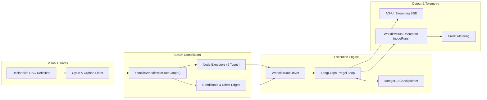
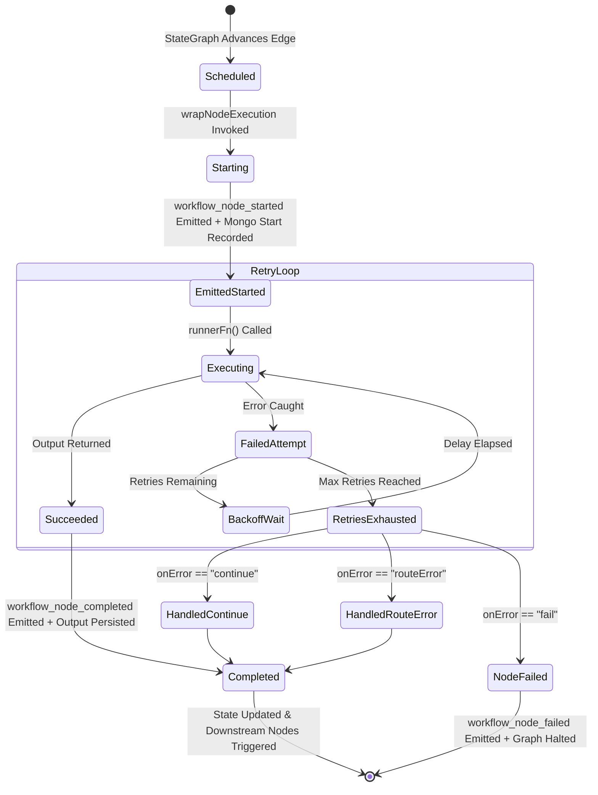

# Workflows DAG Engine: Functional & Non-Functional Requirements (FR/NFR) Specification

> **Document Version:** 1.0.0  
> **Status:** APPROVED & IMPLEMENTED  
> **Date:** September 2026  
> **Subsystem Scope:** `agent-backend/src/modules/developer/workflows/`  
> **Core Engine:** LangGraph (`@langchain/langgraph`), MongoDB Checkpointer, AG-UI Event Driver  

---

## 1. Executive Architectural Overview

The Workflows DAG Engine is the autonomous multi-agent orchestration backbone of Persona AI. It empowers developers and enterprises to chain specialized agents, deterministic tools, vector knowledge searches, and conditional decision points into resilient, observable execution graphs.

Unlike standard static workflow engines, the Persona Workflows Engine is:
1. **LangGraph Native**: Compiles declarative JSON visual DAG schemas directly into LangGraph `StateGraph` instances.
2. **Statefully Checkpointed**: Saves intermediate node execution states to MongoDB via `@langchain/langgraph-checkpoint-mongodb`.
3. **Decoupled & Reconnectable**: Decouples graph execution from HTTP requests using in-memory `WorkflowRunDriver` instances, allowing clients to disconnect and seamlessly reconnect without aborting background execution.
4. **Crash-Resilient**: Recovers orphaned runs from checkpoint tuples after server restarts or deployments.

---

## 2. Functional Requirements (FR)

### Graph Topology & Validation

* **FR-1: Visual DAG Definition:** The engine MUST accept declarative graph schemas containing arrays of `nodes` and `edges`. Supported node types MUST include: `trigger`, `agentStep`, `toolStep`, `knowledgeStep`, `condition`, `approval`, `parallel`, `join`, and `output`.
* **FR-2: Cycle Detection & Rejection:** The engine MUST reject any graph containing direct or transitive cycles prior to saving or publishing, returning error code `CYCLE_DETECTED` (400).
* **FR-3: Structural Health Validation:** Before execution or publication, the graph MUST be verified to contain exactly one `trigger` node, at least one `output` node, and zero disconnected/unreachable nodes.

### Versioning & Snapshots

* **FR-4: Immutable Version Snapshots:** When publishing a workflow (`POST /publish`), the engine MUST create an immutable `WorkflowVersion` record with an incrementing integer version number.
* **FR-5: Agent Configuration Freezing:** When publishing, the engine MUST snapshot the exact model name, system prompt, and tool names of all referenced agents (`agentSnapshots`). Subsequent mutations to external agent profiles MUST NOT alter the published workflow's behavior.

### Execution & Dynamic Templating

* **FR-6: Context-Aware Template Resolution:** All node configuration inputs MUST support Mustache-style template interpolation (e.g. `{{trigger.payload.orderId}}`, `{{steps.agent_1.output.text}}`). Templates MUST resolve against both scalar values and raw objects.
* **FR-7: Agent Step Execution:** `agentStep` nodes MUST dynamically compile and execute an isolated agent instance via `agentFactory.buildAgent()`, stream child AG-UI events tagged with `parentStepId`, and estimate token usage.
* **FR-8: Dry-Run Tool Stripping:** When executing with `isDryRun: true`, the engine MUST strip all mutating external tools (`mcps`, `restApiTools`, `rcpSources`) and return mock responses, preventing accidental real-world side effects.
* **FR-9: Knowledge Base Retrieval:** `knowledgeStep` nodes MUST query project vector knowledge collections via `knowledgeService.searchKnowledgeBase()` and inject matching document excerpts into graph state.
* **FR-10: Conditional Branching:** `condition` nodes MUST evaluate boolean or template expressions and dynamically route execution along `trueBranch` or `falseBranch` edges.

### Streaming & Resumption

* **FR-11: Monotonic Event Streaming:** The engine MUST emit real-time AG-UI protocol events (`RUN_STARTED`, `workflow_node_started`, `workflow_node_completed`, `RUN_FINISHED`, `workflow_node_failed`) with monotonically increasing sequence numbers (`seq`).
* **FR-12: Seamless Reconnection & Replay:** Clients reconnecting via `GET /runs/{runId}/resume?sinceSeq=N` MUST receive all missed frames replayed from the driver's in-memory buffer before transitioning to live streaming. If the in-memory driver has expired, the server MUST return the persisted MongoDB state snapshot.

---

## 3. Non-Functional Requirements (NFR)

### Concurrency & Capacity

* **NFR-1: Per-Workflow Concurrency Gating:** The engine MUST enforce a maximum of 5 concurrent runs per workflow. Additional execution attempts MUST be rejected with HTTP 429 (`CONCURRENCY_LIMIT_EXCEEDED`).
* **NFR-2: Atomic Reservation & Release:** Concurrency slot reservation and release MUST be executed atomically using MongoDB `$inc` operations to prevent race conditions under high traffic.

### Performance & Latency

* **NFR-3: Sub-Second Stream Startup:** The latency between receiving an execution request and emitting the first `RUN_STARTED` event MUST be less than 200ms.
* **NFR-4: Template Resolution Overhead:** Template interpolation across deep graph states MUST execute in less than 5ms per step.

### Reliability, Recovery & Teardown

* **NFR-5: Event Loop Cleanliness (Zero Hanging Handles):** Eviction timers in `WorkflowRunDriver` (`abort`, `finish`, `fail`) MUST be unreferenced (`timer.unref()`) to allow clean process termination and zero lingering handles.
* **NFR-6: Orphan Run Crash Recovery:** A background Agenda job (`recoverOrphanWorkflowRuns.job.js`) running every 5 minutes MUST detect runs marked `running` without an active in-memory driver and resume them from their latest MongoDB checkpoint tuple.
* **NFR-7: Node Retry & Backoff:** Individual node failures MUST respect configurable retry policies (`maxRetries`, `backoffMs`, `exponential`) before executing the declared `onError` strategy (`fail`, `continue`, `routeError`).

### Security & Multi-Tenancy

* **NFR-8: Cross-Tenant Domain Isolation:** All workflow operations MUST enforce tenant domain boundaries. A caller MUST never access or execute a workflow belonging to another project.
* **NFR-9: Multi-Tier Authorization:** Project Admins have full access to all project workflows. External users (`ProjectRuntime`) can only execute public workflows or mutate workflows they explicitly own (`externalOwnerId`).

---

## 4. Node Execution Lifecycle State Machine

---

## 5. Verification Matrix & Test Status

| Requirement | Implementation Component | Verification Test Suite | Status |
| :--- | :--- | :--- | :---: |
| **FR-1, FR-2, FR-3** | `workflow.validator.js`, `workflow.service.js` | `tests/workflowEngine.test.js` | **PASS** |
| **FR-4, FR-5** | `workflowVersion.repository.js`, `workflow.service.js` | `tests/workflowService.test.js` | **PASS** |
| **FR-6** | `templateResolver.js` | `tests/workflowEngine.test.js` | **PASS** |
| **FR-7, FR-8, FR-10**| `workflow.factory.js` | `tests/workflowEngine.test.js`, `tests/workflowService.test.js` | **PASS** |
| **FR-11, FR-12** | `workflowRunDriver.js`, `workflow.service.js` | `tests/workflowEngine.test.js` | **PASS** |
| **NFR-1, NFR-2** | `workflow.repository.js` | `tests/workflowService.test.js` | **PASS** |
| **NFR-5** | `workflowRunDriver.js` (`unref` on timers) | `tests/workflowEngine.test.js` | **PASS** |
| **NFR-6** | `workflow.service.js` (`resumeOrphanRun`) | `tests/workflowService.test.js` | **PASS** |
| **NFR-8, NFR-9** | `workflow.service.js` (`canMutateWorkflow`, `canAccessWorkflow`) | `tests/workflowEngine.test.js` | **PASS** |
