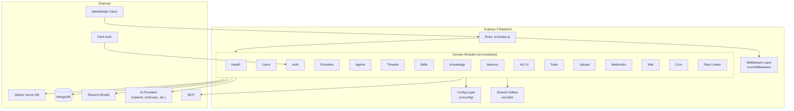
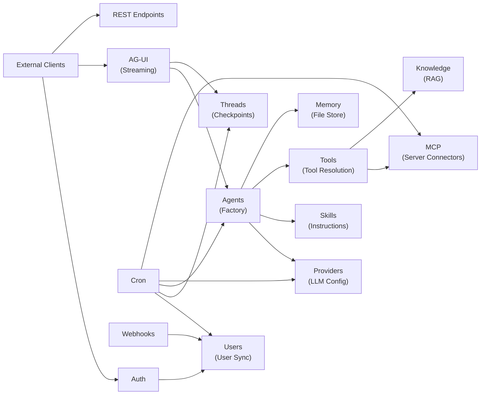

# Architecture Overview

## Why Domain-Based Modular Architecture?

The backend was refactored from a flat structure into **domain-based modules** to address several problems:

1. **Cohesion** — Each business capability (Agents, Threads, Knowledge, etc.) was scattered across `controllers/`, `services/`, `repositories/`, `models/`, and `routes/` directories
2. **Discoverability** — Finding all code for a feature required opening 5+ directories
3. **Tight Coupling** — Any service could import any model, leading to circular dependencies
4. **Scalability** — Adding new features meant creating files in 5+ separate directories

The modular architecture groups code by **domain** rather than by **layer**, making the system easier to navigate, maintain, and extend.

## High-Level Architecture



## Layer Responsibilities

| Layer            | Responsibility                                               | Examples                                               |
| ---------------- | ------------------------------------------------------------ | ------------------------------------------------------ |
| **Routes**       | Define HTTP methods, paths, middleware chains                | `agent.routes.js`, `thread.routes.js`                  |
| **Controllers**  | Extract request data, call services, format responses        | `agent.controller.js`, `health.controller.js`          |
| **Services**     | Business logic, orchestration, cross-module coordination     | `agent.service.js`, `mcp.service.js`                   |
| **Repositories** | Database access, query execution, data persistence           | `agent.repository.js`, `user.repository.js`            |
| **Models**       | Mongoose schemas, data validation, indexes                   | `agent.model.js`, `thread.model.js`                    |
| **Validators**   | Zod schemas for request validation                           | `agent.validator.js`, `mcp.validator.js`               |
| **Middleware**   | Cross-cutting concerns (auth, rate limiting, error handling) | `auth.middleware.js`, `rateLimiter.middleware.js`      |
| **Factories**    | Complex object construction (agent graph compilation)        | `agent.factory.js`                                     |
| **Tools**        | LangChain-compatible tool definitions for AI agents          | `knowledge.tools.js`, `mcp.tools.js`, `search.tool.js` |

## Core Module Relationships



## Design Principles

1. **Single Responsibility** — Each layer has one job; routes don't contain business logic, controllers don't query databases
2. **Dependency Inversion** — High-level modules (services) depend on abstractions (repositories), not concrete implementations
3. **Interface Segregation** — Formatters, loggers, and validators are independent interfaces
4. **Encapsulation** — Module internals are private; only the `index.js` barrel export exposes the public API
5. **Consistency** — Every module follows the same structural pattern

## Directory Layout

```
src/
├── index.js                    # Express app entry point
├── config/                     # Environment configuration
│   ├── index.js                # Central config loader
│   ├── database.js             # MongoDB connection singleton
│   ├── ai.config.js            # AI provider config
│   ├── jwt.config.js           # JWT config (for OAuth state)
│   └── mail.config.js          # Email provider config
├── middlewares/
│   ├── errorHandler.js         # Global error handler
│   └── validationMiddleware.js # Zod validation middleware factory
├── modules/                    # Domain modules (17 total)
│   ├── <module>/
│   │   ├── index.js            # Barrel exports
│   │   ├── <module>.routes.js  # Express router
│   │   ├── <module>.controller.js
│   │   ├── <module>.service.js
│   │   ├── <module>.repository.js
│   │   ├── <module>.model.js
│   │   └── <module>.validator.js
│   └── ...
├── utils/                      # Shared utilities
│   ├── errors/                 # Custom error classes
│   ├── formatters/             # Response formatters
│   ├── logger/                 # Logger abstraction
│   ├── validators/             # Zod validation helpers
│   ├── encryption.js           # AES-256-GCM encryption
│   └── constants.js            # HTTP status codes, error codes
└── docs/
    └── openapi.js              # OpenAPI/Swagger spec
```

## Next Steps

- [Learn the Request Lifecycle](request-lifecycle.md)
- [Explore the Module System](module-system.md)
- [Review Dependency Rules](dependency-rules.md)
