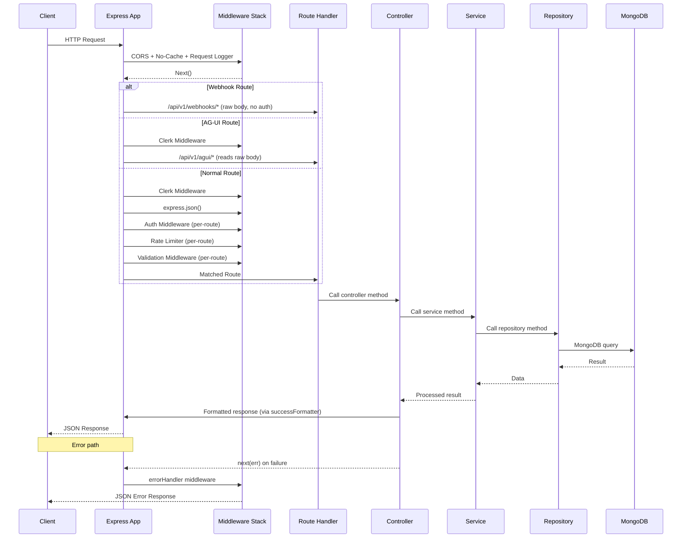
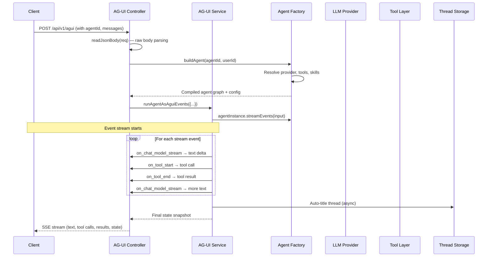
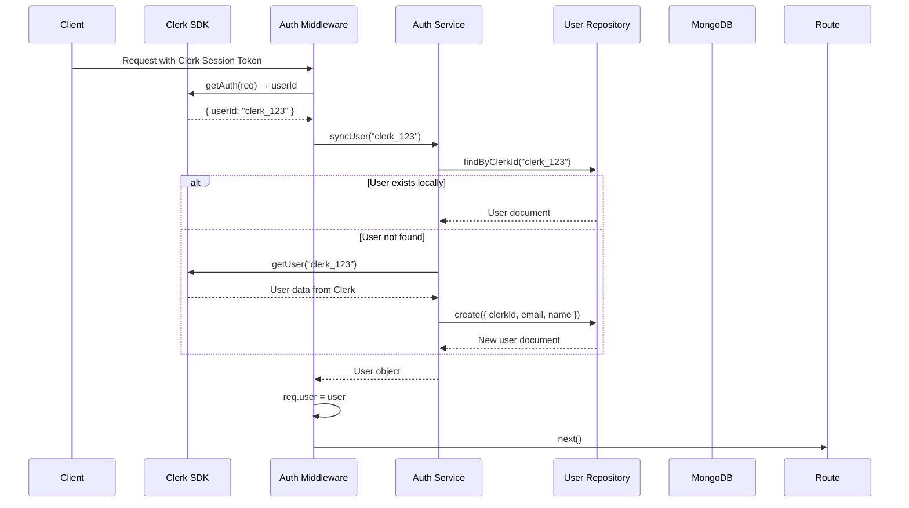

# Request Lifecycle

## Standard REST Request Flow



## Detailed Step-by-Step

### 1. Request Arrives

```javascript
// src/index.js — Entry point
import express from 'express';
const app = express();

app.use(cors()); // Cross-origin support
app.use(noCacheHeaders()); // Prevent caching
app.use(requestLogger()); // Log every request
```

### 2. Route Resolution

Routes are registered in a specific order to handle special cases:

```javascript
// 1. Webhooks — raw body, bypasses Clerk auth
app.use('/api/v1/webhooks', webhookRouter);

// 2. Clerk middleware (for all subsequent routes)
app.use(clerkMiddleware());

// 3. AG-UI — reads raw body before express.json()
app.use('/api/v1/agui', aguiRouter);

// 4. Standard JSON parsing
app.use(express.json());

// 5. All API routes
app.use('/api/v1/health', healthRouter);
app.use('/api/v1/profile', profileRouter);
app.use('/api/v1/agents', agentRouter);
// ...etc
```

### 3. Module-Level Processing

Within each module, the route handler chains middleware:

```javascript
// Example: agent.routes.js
router.post(
  '/search',
  optionalAuthMiddleware, // Auth (optional)
  validateBody(searchSchema), // Validation
  agentController.search // Controller
);

router.use(authMiddleware); // All remaining routes require auth

router.post(
  '/',
  rateLimiter('MUTATE', { maxRequests: 30, windowMs: 60000 }), // Rate limit
  validateBody(createSchema), // Validation
  agentController.create // Controller
);
```

### 4. Controller → Service → Repository

```javascript
// Controller extracts HTTP concerns
controller.create = async (req, res, next) => {
  try {
    const result = await service.create(req.body, req.user._id);
    res.status(201).json(formatSuccess(result, 'Created'));
  } catch (err) {
    next(err);
  }
};

// Service contains business logic
service.create = async (data, userId) => {
  validateBusinessRules(data);
  return repository.create({ ...data, ownerId: userId });
};

// Repository handles data access
repository.create = async (data) => {
  return Model.create(data);
};
```

### 5. Error Handling

If any layer throws, the error propagates to the global error handler:

```javascript
// src/middlewares/errorHandler.js
export default function errorHandler(err, req, res, next) {
  logger.error('Request error', { message: err.message, ... });
  const statusCode = err.statusCode || 500;
  const errorResponse = errorFormatter.formatError(err, statusCode);
  res.status(statusCode).json(errorResponse);
}
```

## AG-UI/SSE Streaming Flow

The AG-UI protocol is a special case — it uses SSE (Server-Sent Events) instead of standard JSON responses.



## Authentication Flow



## Caching

All API responses include `no-cache` headers:

```
Cache-Control: no-store, no-cache, must-revalidate, proxy-revalidate
Pragma: no-cache
Expires: 0
```

## Next Steps

- [Explore the Module System](module-system.md)
- [Review Dependency Rules](dependency-rules.md)
