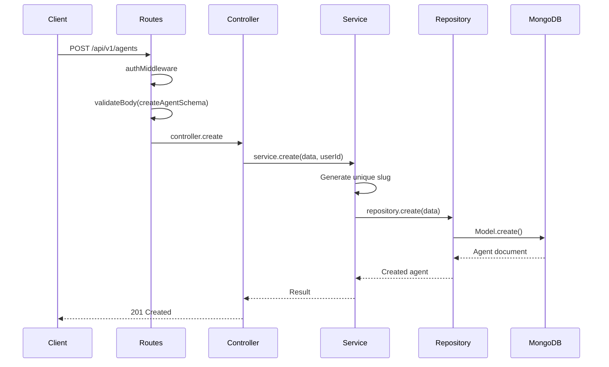
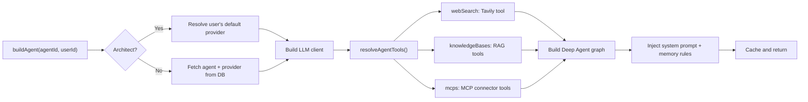

# Agents Module

## Purpose

Manages AI **agent configurations** — the core entities that define an AI agent's identity, capabilities, and behavior. Users create agents, assign them to LLM providers, attach skills/MCP servers/knowledge bases, and configure their system prompts.

## Location

`src/modules/agents/`

## Structure

```
src/modules/agents/
├── index.js                   # Barrel exports
├── agent.routes.js            # REST API routes
├── agent.controller.js        # HTTP handlers
├── agent.service.js           # Business logic
├── agent.repository.js        # Database access
├── agent.model.js             # Mongoose schema
├── agent.factory.js           # Deep Agent graph compilation
├── agent.validator.js         # Zod validation schemas
└── architectConstants.js      # Special Architect agent ID
```

## Responsibilities

- CRUD operations for agent configurations
- Agent search with public/private visibility filtering
- Agent count for marketplace statistics
- Agent graph compilation (building Deep Agent instances from configuration)
- Architect meta-agent management
- Per-agent memory filesystem management
- Slug-based URL resolution

## Request Flow



## Dependencies

| Dependency | Type | Purpose |
|-----------|------|---------|
| Auth module | Internal | Authentication middleware |
| Providers module | Internal | Resolve LLM provider config |
| Skills module | Internal | Agent skills store |
| MCP module | Internal | MCP tool resolution |
| Knowledge module | Internal | Knowledge base tools |
| Tools module | Internal | Tool resolution |
| Threads module | Internal | Checkpointer for graph persistence |
| Memory module | Internal | File-based memory store |
| Rate Limiter module | Internal | Rate limiting middleware |
| Encryption | Utility | API key decryption for LLM client |

## Data Model (Agent)

| Field | Type | Description |
|-------|------|-------------|
| `ownerId` | ObjectId (User) | Agent owner |
| `name` | String (2-100) | Agent name |
| `slug` | String (unique) | URL-friendly identifier |
| `description` | String (500) | Short description |
| `systemPrompt` | String (10+) | AI system prompt |
| `providerId` | ObjectId (Provider) | LLM provider reference |
| `modelName` | String | Override provider's default model |
| `webSearchEnabled` | Boolean | Enable web search capability |
| `skills` | [ObjectId (Skill)] | Attached skills |
| `mcps` | [ObjectId (Mcp)] | Attached MCP servers |
| `knowledgeBases` | [ObjectId (KnowledgeBase)] | Attached knowledge bases |
| `interruptOn` | Map(String → Boolean) | HITL interrupt config for tools |
| `visibility` | enum: private/unlisted/public | Agent visibility |
| `category` | enum | Agent category |
| `isMainAgent` | Boolean | Primary agent flag |
| `messageCount` | Number | Usage counter |

## Public API

| Method | Path | Auth | Purpose |
|--------|------|------|---------|
| `POST` | `/api/v1/agents/search` | Optional | Search agents with filters |
| `POST` | `/api/v1/agents/count` | Optional | Count matching agents |
| `GET` | `/api/v1/agents/slug/:slug` | Optional | Get agent by URL slug |
| `GET` | `/api/v1/agents/:id` | Optional | Get agent by ID |
| `POST` | `/api/v1/agents` | Required | Create agent |
| `PATCH` | `/api/v1/agents/:id` | Required | Update agent |
| `DELETE` | `/api/v1/agents/:id` | Required | Delete agent |
| `GET` | `/api/v1/agents/:id/memory` | Required | Get agent memory |
| `DELETE` | `/api/v1/agents/:id/memory/:key` | Required | Delete memory key |

## Authentication & Authorization

- **Search/Count/Get** — Optional auth (public agents visible to all; private agents visible to owner only)
- **Create/Update/Delete** — Requires authentication (owner only)
- **Memory** — Requires authentication (owner only)

## Important Business Rules

### The Agent Factory

`agent.factory.js` is the most complex file in the agents module. It:

1. Resolves the LLM provider and decrypts the API key
2. Assembles the agent's toolset (web search, MCP tools, knowledge base tools, builder tools)
3. Constructs a Deep Agent graph with checkpointer
4. Injects the system prompt with dynamic memory rules
5. Caches compiled instances in an LRU cache (max 50)
6. Handles the special **Architect Agent** (meta-agent for agent creation)



### The Architect Agent

A special system agent (identified by `ARCHITECT_AGENT_ID`) that helps users create and configure agents. It:
- Uses the user's default provider
- Has hardcoded system prompt with builder instructions
- Has HITL interrupts enabled for dangerous actions (agent CRUD, skill management)
- Gets the Builder Toolbox tools

### Agent Slugs

Every agent gets a unique, auto-generated slug. Slugs must be unique across all agents. They are used for URL-friendly agent access.

### Visibility System

- **Public** — Visible in search results, anyone can view
- **Unlisted** — Not in search, but anyone with the link can view
- **Private** — Only the owner can view

## Extension Guide

### Adding a New Capability

1. **Add a model field** in `agent.model.js` (e.g., `visionEnabled`)
2. **Add validation** in `agent.validator.js`
3. **Handle the field** in `agent.factory.js` during graph compilation
4. If it requires a new tool, add it to `resolveAgentTools()` in `tools/index.js`

### Adding a New Interrupt Guard

1. Add the tool name to the `interruptOn` defaults in `agent.model.js`
2. The agent factory and AG-UI translator handle it automatically

### Creating a New Meta-Agent

1. Define a new constant in `architectConstants.js`
2. Add a new branch in `agent.factory.js` `buildAgent()` method
3. Define its tools in `tools/index.js`
