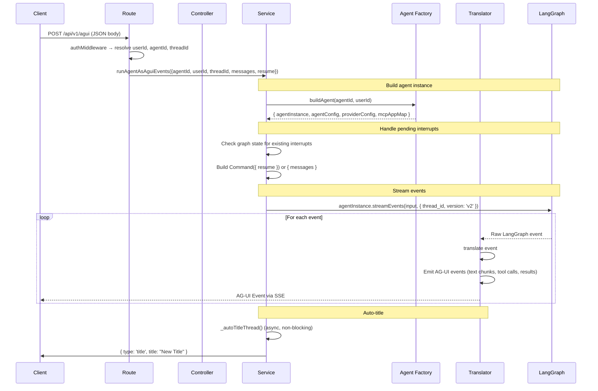

# AG-UI Module

## Purpose

Implements the **AG-UI protocol** — a real-time Server-Sent Events (SSE) streaming protocol for communicating with AI agents. This is the core channel through which the frontend sends messages to agents and receives streaming responses (text, tool calls, tool results, interrupts, state snapshots).

## Location

`src/modules/agui/`

## Structure

```
src/modules/agui/
├── index.js                # Barrel exports
├── agui.routes.js          # SSE route setup
├── agui.controller.js      # HTTP handlers
├── agui.service.js         # Core streaming logic
├── aguiTranslator.js       # LangGraph → AG-UI event translator
├── RunScopeTracker.js      # Subagent ancestry tracker
└── subagentTrace.js        # Server-side subagent trace folding
```

## Responsibilities

- Accept chat messages and stream AI responses via SSE
- Translate LangGraph `streamEvents` into AG-UI protocol events
- Handle human-in-the-loop interrupts (clarification questions, tool approval)
- Manage agent lifecycle (build agent, resume interrupted threads, auto-title)
- Track subagent execution ancestry for parallel task attribution
- Support abort/ cancellation via `AbortController`

## Request Flow



## The AG-UI Translator

`aguiTranslator.js` is the heart of this module. It converts LangGraph's `streamEvents` (v2) format into AG-UI chunk events that the frontend understands.

### Event Types Produced

| AG-UI Event | Source LangGraph Event | Description |
|-------------|----------------------|-------------|
| `TEXT_MESSAGE_CHUNK` | `on_chat_model_stream` (text content) | Streaming assistant text |
| `REASONING_MESSAGE_START` | First reasoning delta | Start of reasoning block |
| `REASONING_MESSAGE_CONTENT` | `reasoning_content` / `reasoning` deltas | Streaming reasoning |
| `REASONING_END` | End of reasoning | Close reasoning block |
| `TOOL_CALL_CHUNK` | `tool_call_chunks` or `on_tool_start` | Tool call with name + args |
| `TOOL_CALL_RESULT` | `on_tool_end` | Tool execution result |
| `STATE_SNAPSHOT` | End of turn / interrupt | Virtual filesystem + todo snapshot |
| `CUSTOM` (hitl_request) | GraphInterrupt (HITL) | Human-in-the-loop approval request |
| `CUSTOM` (clarification_request) | GraphInterrupt (questions) | Clarification questions |
| `CUSTOM` (subagent_activity) | Nested model/tool events | Subagent progress |
| `CUSTOM` (mcp_app) | Tool with MCP App widget | MCP widget resource URI |

### Key Design Decisions

**Why a custom translator?** There is no Node.js LangGraph → AG-UI adapter. The TypeScript `@ag-ui/langgraph` agents only communicate with a deployed LangGraph Platform over HTTP, not an in-process graph. This module is the JavaScript equivalent of the Python `add_langgraph_fastapi_endpoint` helper.

**Subagent tracking with RunScopeTracker:** Deep Agents runs parallel subagents (the `task` tool) via `Promise.all`, which interleaves their events. `RunScopeTracker` records run ancestry (runId → parentRunId) so the translator can attribute nested events to the correct task call.

**Streaming tool args:** Tool call arguments are streamed as the model generates them (`tool_call_chunks`), so the UI shows tool cards immediately instead of waiting for full args + execution.

## HITL (Human-in-the-Loop) Interrupts

When a guarded tool is hit (e.g., `upsert_agent`, `manage_skill`), LangGraph pauses the graph and emits an interrupt:

1. **HITL Request** — The translator emits `hitl_request` with `actionRequests` and `reviewConfigs`
2. **User Responds** — The next request includes `resume.decisions` with approve/reject + feedback
3. **Resume Value** — `buildResumeValue()` in the translator converts the decisions to `Command({ resume })`
4. **Graph Resumes** — The agent continues execution

## Dependencies

| Dependency | Type | Purpose |
|-----------|------|---------|
| Agents module | Internal | `agentFactory.buildAgent()` |
| Threads module | Internal | Thread lookup, checkpoint service |
| Auth module | Internal | Authentication |
| Rate Limiter module | Internal | Chat rate limiting |

## Public API

| Method | Path | Auth | Purpose |
|--------|------|------|---------|
| `GET` | `/api/v1/agui` | Required | AG-UI protocol info |
| `POST` | `/api/v1/agui` | Required | Send message & stream response |

## Important Business Rules

### Raw Body Reading

AG-UI reads its own raw request body **before** `express.json()` consumes the stream. This is necessary because the body may contain large messages and the route needs direct access to the byte stream.

### Thread Resolution

- If `x-agent-id` and `x-thread-id` headers are provided, the thread is resolved by ID
- If only `x-agent-id` is provided, a deterministic `agui-<agentId>-<userId>` thread ID is used
- Thread last-message timestamp is updated on each interaction

### Interrupt Persistence

When a graph pauses for an interrupt, the `langGraphThreadId` is preserved so the next request resumes the same thread. The translator emits state snapshots on interrupts (preserving files/todos created before the pause).

### Auto-Titling

When a thread title is still "New Conversation", the service asynchronously calls the LLM to generate a title from the first user message. This is non-blocking — the stream continues while the title is generated.
