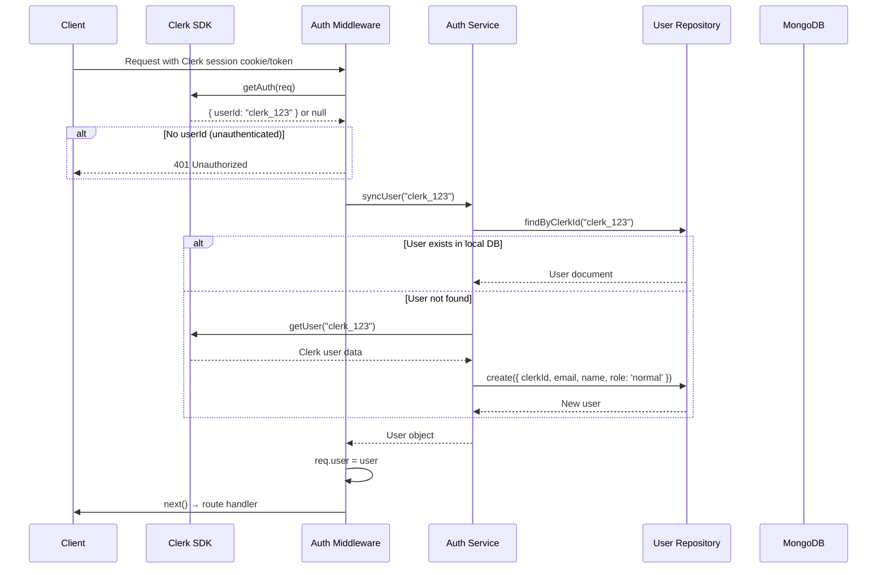

# Auth Module

## Purpose

Handles **authentication and authorization** using **Clerk** as the external auth provider. Authenticates requests, syncs Clerk users to the local MongoDB database, and provides both required and optional authentication middleware.

## Location

`src/modules/auth/`

## Structure

```
src/modules/auth/
├── index.js                      # Barrel exports
├── auth.middleware.js            # Required auth middleware
├── auth.service.js               # User sync service
└── optional-auth.middleware.js   # Optional auth middleware
```

## Responsibilities

- Verify Clerk session tokens on incoming requests
- Auto-sync Clerk users to local MongoDB on first login
- Provide `authMiddleware` (required auth — returns 401 if not authenticated)
- Provide `optionalAuthMiddleware` (sets `req.user` if authenticated, continues if not)

## Authentication Flow



## Key Components

### authMiddleware (Required Auth)

```javascript
// Usage in routes:
router.use(authMiddleware); // All routes below require auth
router.get('/', controller.getAll);

// Per-route:
router.post('/', authMiddleware, controller.create);
```

Throws `BaseError(401, 'UNAUTHORIZED')` if no valid session is found.

### optionalAuthMiddleware (Optional Auth)

```javascript
// Usage:
router.post('/search', optionalAuthMiddleware, controller.search);
```

Sets `req.user` if authenticated, silently continues if not. Useful for endpoints where authenticated users get enhanced results (e.g., public agent search).

### authService (User Sync)

`syncUser(clerkId)` is the bridge between Clerk and the local database:

1. Tries to find user by `clerkId`
2. If not found, fetches user data from Clerk API
3. Creates a local user record
4. Handles edge cases: email-based user matching, username provision

## Dependencies

| Dependency       | Type     | Purpose                       |
| ---------------- | -------- | ----------------------------- |
| Users module     | Internal | User repository for DB lookup |
| `@clerk/express` | External | Clerk session verification    |

## Public API

No dedicated REST endpoints — this is middleware-only. Auth endpoints (login, signup, etc.) are handled entirely by Clerk's hosted UI.

## Important Details

### User Sync on First Login

When a user logs in via Clerk for the first time, `syncUser()` automatically creates their local user record. This happens transparently — developers don't need to manage user creation separately.

### Auto-Sync via Webhooks

The [Webhooks module](webhooks.md) also handles `user.created` and `user.deleted` events from Clerk for lifecycle management outside of authentication flows.

### Clerk Webhook Verification

Clerk webhook events are verified using **Svix** signature verification, not Clerk middleware. See the webhooks module for details.
