# Cron Module

## Purpose

Manages **scheduled background jobs** using `node-cron`. Currently handles automatic cleanup of inactive user accounts.

## Location

`src/modules/cron/`

## Structure

```
src/modules/cron/
├── index.js                   # Job registration and lifecycle
└── deleteInactiveUsers.js     # Inactive user cleanup job
```

## Responsibilities

- Register and manage cron jobs on server startup
- Stop all cron jobs on graceful shutdown
- Delete inactive user accounts after retention period expires
- Clean up all user-associated data (threads, checkpoints, agents, skills, providers, MCP servers, MCP user connections)

## Registered Jobs

| Job Name              | Schedule                    | Description                                    | Config Variable                                        |
| --------------------- | --------------------------- | ---------------------------------------------- | ------------------------------------------------------ |
| `deleteInactiveUsers` | `0 3 * * *` (daily at 3 AM) | Purge inactive users older than retention days | `CRON_DELETE_INACTIVE_USERS`, `ACCOUNT_RETENTION_DAYS` |

## Disabling Cron Jobs

Set `DISABLE_CRON=true` in environment variables to disable all scheduled jobs.

## Cleanup Process

```mermaid
flowchart LR
    A["deleteInactiveUsers()"] --> B["Find inactive users<br/>past retention period"]
    B --> C["For each user:"]
    C --> D["Delete LangGraph checkpoints"]
    D --> E["Delete conversation threads"]
    E --> F["Delete agents, skills, providers, MCP servers"]
    F --> G["Delete MCP user connections"]
    G --> H["Delete user document"]
    H --> I["Continue to next user"]
```



## What Gets Deleted per User

1. LangGraph checkpoints (via `checkpointService.cleanupThreads`)
2. Conversation threads
3. All agents owned by the user
4. All skills owned by the user
5. All providers owned by the user
6. All MCP servers owned by the user
7. All MCP user connections for the user
8. The user document itself

## Dependencies

| Dependency       | Type     | Purpose                       |
| ---------------- | -------- | ----------------------------- |
| Users module     | Internal | User model and repository     |
| Agents module    | Internal | Agent cleanup                 |
| Skills module    | Internal | Skill cleanup                 |
| Providers module | Internal | Provider cleanup              |
| MCP module       | Internal | MCP server cleanup            |
| Threads module   | Internal | Thread and checkpoint cleanup |
| `node-cron`      | External | Cron scheduling               |

## Lifecycle

Cron jobs are started and stopped from `src/index.js`:

```javascript
import { startAllCronJobs, stopAllCronJobs } from './modules/cron/index.js';

// On server start
await database.connect();
startAllCronJobs();

// On graceful shutdown
process.on('SIGINT', () => {
  stopAllCronJobs();
  database.closeConnection();
  process.exit(0);
});
```
