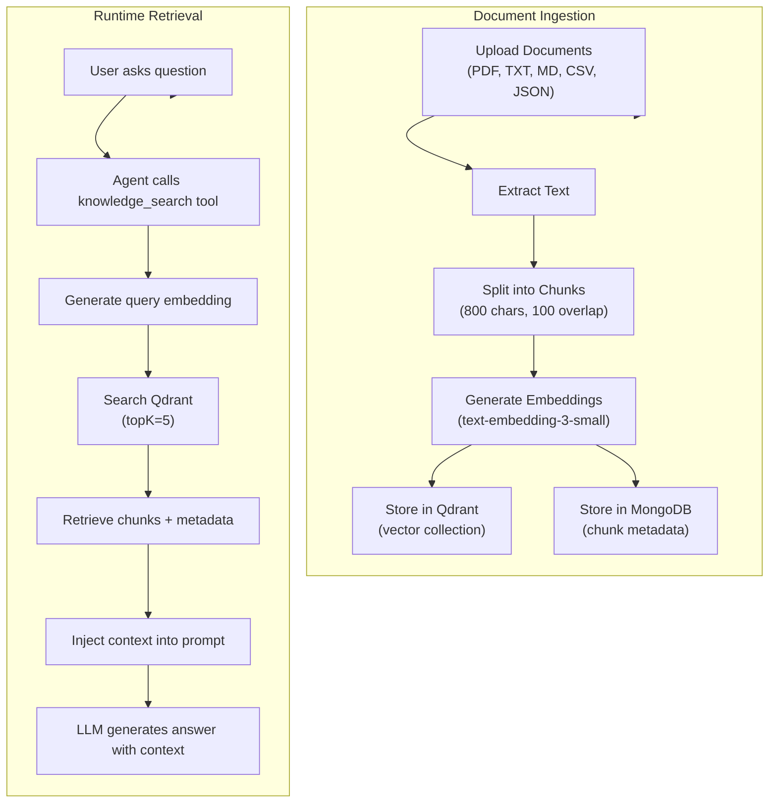

# Knowledge Module

## Purpose

Implements **Retrieval-Augmented Generation (RAG)** capabilities. Users can create knowledge bases, upload documents, and attach them to agents so they can semantically search the content during conversations.

## Location

`src/modules/knowledge/`

## Structure

```
src/modules/knowledge/
├── index.js                       # Barrel exports
├── knowledge.routes.js            # REST API routes
├── knowledge.controller.js        # HTTP handlers
├── knowledge.service.js           # Business logic
├── knowledge.repository.js        # Database access
├── knowledge-base.model.js        # KnowledgeBase Mongoose schema
├── knowledge-chunk.model.js       # KnowledgeChunk Mongoose schema
├── knowledge.validator.js         # Zod validation schemas
└── knowledge.tools.js             # LangChain RAG tools for agents
```

## Responsibilities

- CRUD operations for knowledge bases
- Document upload and ingestion (PDF, TXT, MD, JSON, CSV)
- Document chunking and vector embedding
- Vector storage in Qdrant
- Semantic search across knowledge bases
- Tool generation for agents (semantic search + list sources)

## RAG Flow



## Data Models

### KnowledgeBase

| Field | Type | Description |
|-------|------|-------------|
| `name` | String (200) | Knowledge base name |
| `description` | String (1000) | KB description |
| `ownerId` | ObjectId (User) | KB owner |
| `isPublic` | Boolean | Public visibility flag |
| `documentCount` | Number | Number of uploaded documents |
| `chunkCount` | Number | Total chunk count |
| `qdrantCollectionName` | String (unique) | Qdrant collection identifier |
| `documents` | [Document] | Document manifest |
| `embeddingModel` | String | Embedding model name |
| `chunkSize` | Number (default: 800) | Chunk size in characters |
| `chunkOverlap` | Number (default: 100) | Chunk overlap |
| `topK` | Number (default: 5) | Results per search |

### KnowledgeChunk

| Field | Type | Description |
|-------|------|-------------|
| `knowledgeBaseId` | ObjectId | Parent KB |
| `sourceName` | String | Source document name |
| `chunkIndex` | Number | Position in document |
| `content` | String | Chunk text content |
| `vectorId` | String | Qdrant point ID |

## Supported File Types

| Type | Extension | MIME Type |
|------|-----------|-----------|
| PDF | `.pdf` | `application/pdf` |
| Text | `.txt` | `text/plain` |
| Markdown | `.md` | `text/markdown` |
| CSV | `.csv` | `text/csv` |
| JSON | `.json` | `application/json` |

## Public API

| Method | Path | Auth | Purpose |
|--------|------|------|---------|
| `POST` | `/api/v1/knowledge` | Required | Create knowledge base |
| `GET` | `/api/v1/knowledge` | Required | List knowledge bases |
| `GET` | `/api/v1/knowledge/:id` | Required | Get KB details |
| `PATCH` | `/api/v1/knowledge/:id` | Required | Update KB |
| `DELETE` | `/api/v1/knowledge/:id` | Required | Delete KB |
| `POST` | `/api/v1/knowledge/:id/upload` | Required | Upload documents |
| `GET` | `/api/v1/knowledge/:id/documents` | Required | List documents |
| `DELETE` | `/api/v1/knowledge/:id/documents/:sourceName` | Required | Delete a document |
| `POST` | `/api/v1/knowledge/:id/search` | Required | Search KB |

## Agent Tools

When an agent has knowledge bases attached, two tools are provided:

1. **`knowledge_search`** — Semantic search across the knowledge base. Takes a query string, returns relevant chunks with source attribution.
2. **`list_knowledge_sources`** — Lists all document sources in the KB with metadata.

## Dependencies

| Dependency | Type | Purpose |
|-----------|------|---------|
| Auth module | Internal | Authentication middleware |
| Qdrant | External | Vector storage and search |
| OpenAI | External | Text embeddings |
| Multer | External | File upload handling |
| PDF-Parse | External | PDF text extraction |

## Important Business Rules

### Ingestion Pipeline

1. Files are uploaded via multer (in-memory storage, 20MB limit, max 10 files)
2. Text is extracted from each file type
3. Text is split into chunks (configurable size/overlap, default 800/100)
4. Each chunk is embedded using `text-embedding-3-small`
5. Embeddings stored in Qdrant, metadata in MongoDB

### Search Parameters

- `topK`: Number of chunks to return (configurable per KB, default 5)
- Results include source document name, chunk content, and relevance score

### Cleanup

When a knowledge base is deleted, both the Qdrant collection and MongoDB records are cleaned up.
