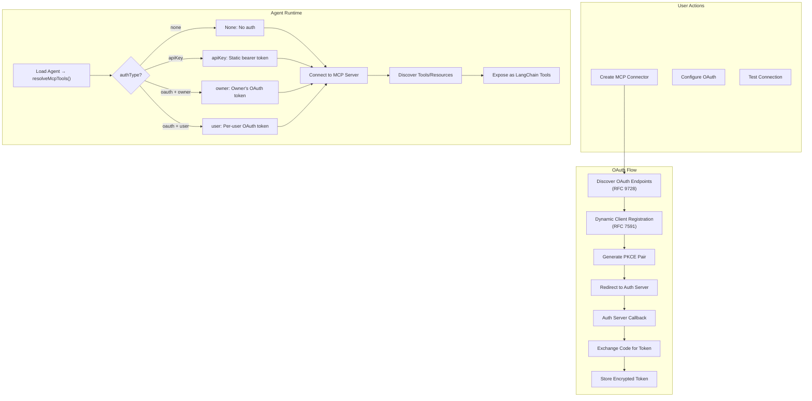

# MCP Module

## Purpose

Manages **Model Context Protocol (MCP)** server connectors. Allows users to register MCP servers, authenticate via OAuth (with PKCE), and expose their tools/resources to AI agents.

## Location

`src/modules/mcp/`

## Structure

```
src/modules/mcp/
├── index.js                          # Barrel exports
├── mcp.routes.js                     # REST API routes
├── mcp.controller.js                 # HTTP handlers
├── mcp.service.js                    # Business logic
├── mcp.repository.js                 # Database access
├── mcp.model.js                      # Mongoose schema
├── mcp.validator.js                  # Zod validation schemas
├── mcp.tools.js                      # MCP → LangChain tool adapter
├── mcp-token.service.js              # Token management (access/refresh)
├── mcp-oauth-client.js               # OAuth 2.0 client (discovery, PKCE, token exchange)
├── mcp-user-connection.model.js      # Per-user OAuth connection model
├── mcp-user-connection.repository.js # User connection data access
└── oauth-state.js                    # Signed OAuth state tokens
```

## Responsibilities

- CRUD operations for MCP server configurations
- MCP server connection testing
- OAuth 2.0 authorization flow (client registration, PKCE, token exchange, refresh)
- Tool discovery and resolution from MCP servers
- Resource/Resource Template discovery
- Per-user OAuth connections for user-mode auth
- Integration with LangChain's `@langchain/mcp-adapters`

## MCP Connection Flow



## OAuth Implementation

The MCP module implements a complete OAuth 2.0 client flow:

### Discovery (RFC 9728 / RFC 8414)

1. Fetch resource metadata from `/.well-known/oauth-protected-resource/<path>`
2. Find the authorization server metadata URL
3. Fetch authorization + token endpoints

### Dynamic Client Registration (RFC 7591)

1. POST client metadata to the registration endpoint
2. Try confidential client (`client_secret_basic`) first
3. Fall back to public client if no secret is returned

### PKCE (Proof Key for Code Exchange)

- `codeVerifier`: 32 random bytes, base64url-encoded
- `codeChallenge`: SHA-256 hash of verifier, base64url-encoded

### State Signing

OAuth `state` parameters are signed using HMAC-SHA256 with the JWT secret to prevent CSRF attacks. The state encodes the `mcpId`, `userId`, and `authMode` so the callback can recover the context without a session.

### Token Management

- **Owner tokens** — Stored on the `Mcp` document, refreshed automatically 60s before expiry
- **User tokens** — Stored on `McpUserConnection` documents (one per user per MCP server)
- All tokens encrypted at rest with AES-256-GCM

## Data Models

### Mcp

| Field | Type | Description |
|-------|------|-------------|
| `ownerId` | ObjectId | Connector owner |
| `name` | String (2-100) | Server name |
| `transport` | enum: http/sse | MCP transport protocol |
| `url` | String | Server URL |
| `authType` | enum: none/oauth/apiKey | Authentication method |
| `authMode` | enum: owner/user | Token sharing model |
| `oauth` | Object | OAuth configuration (client_id, endpoints, scopes, tokens) |
| `apiKeyEncrypted` | String (encrypted) | Static API key |
| `tools` | [Tool] | Discovered tool definitions |
| `resources` | [Resource] | Discovered resource definitions |
| `resourceTemplates` | [ResourceTemplate] | Discovered URI templates |

### McpUserConnection

| Field | Type | Description |
|-------|------|-------------|
| `mcpId` | ObjectId | MCP server reference |
| `userId` | ObjectId | User who authorized |
| `accessTokenEncrypted` | String (encrypted) | User's access token |
| `refreshTokenEncrypted` | String (encrypted) | User's refresh token |
| `expiresAt` | Date | Token expiry |

## Tool Resolution

`mcp.tools.js` contains `resolveMcpTools()` which:

1. Iterates over agent's attached MCP servers
2. Filters out disabled servers
3. Resolves tokens based on auth mode (owner/user/apiKey/none)
4. Creates a `MultiServerMCPClient` from `@langchain/mcp-adapters`
5. Loosens Zod schemas so LLM tool call errors are recoverable (not fatal)
6. Returns LangChain `DynamicStructuredTool` array

### Schema Loosening

MCP tool schemas are recursively loosened so missing/hallucinated fields don't crash the agent — instead, they become normal MCP errors the agent can recover from.

## Public API

| Method | Path | Auth | Purpose |
|--------|------|------|---------|
| `GET` | `/api/v1/mcps` | Required | List user's MCP servers |
| `POST` | `/api/v1/mcps` | Required | Create MCP server |
| `GET` | `/api/v1/mcps/:id` | Required | Get MCP server details |
| `PATCH` | `/api/v1/mcps/:id` | Required | Update MCP server |
| `DELETE` | `/api/v1/mcps/:id` | Required | Delete MCP server |
| `POST` | `/api/v1/mcps/:id/test` | Required | Test connection |
| `GET` | `/api/v1/mcps/:id/resource` | Required | Read a resource |
| `POST` | `/api/v1/mcps/:id/call-tool` | Required | Call an MCP tool directly |
| `GET` | `/api/v1/mcps/:id/agents` | Required | List agents using this MCP |
| `GET` | `/api/v1/mcps/:id/oauth/owner/authorize` | Required | Get owner OAuth URL |
| `GET` | `/api/v1/mcps/:id/oauth/user/authorize` | Required | Get user OAuth URL |
| `GET` | `/api/v1/mcps/:id/oauth/user/status` | Required | Check user connection status |
| `DELETE` | `/api/v1/mcps/:id/oauth/user/connection` | Required | Disconnect user |
| `DELETE` | `/api/v1/mcps/:id/oauth/owner/connection` | Required | Disconnect owner |
| `GET` | `/api/v1/mcps/oauth/owner/callback` | None | OAuth owner callback |
| `GET` | `/api/v1/mcps/oauth/user/callback` | None | OAuth user callback |

OAuth callbacks deliberately don't use authMiddleware (they're hit by the auth server's browser redirect, which has no session).

## Dependencies

| Dependency | Type | Purpose |
|-----------|------|---------|
| Auth module | Internal | Authentication middleware |
| Rate Limiter module | Internal | Rate limiting |
| Encryption | Utility | Token encryption/decryption |
| Config | Internal | JWT secret for OAuth state |

## Important Business Rules

### OAuth Callbacks Are Public
The OAuth callback routes (`/oauth/owner/callback`, `/oauth/user/callback`) deliberately bypass authMiddleware. The auth server redirects the browser to these URLs, and the redirect doesn't carry a session cookie. Identity is recovered from the signed `state` parameter.

### Owner vs User Mode
- **Owner** — The MCP creator authorizes once; all users of the agent share that token
- **User** — Each end-user authorizes their own connection; one user's authorization doesn't grant access to another's

### Token Refresh
Access tokens are refreshed automatically 60 seconds before expiry. The `mcp-token.service.js` handles this transparently during tool resolution.

### API Key Auth
For `authType: 'apiKey'`, a static bearer token is sent on every request. No OAuth flow needed — just configure the key once.
