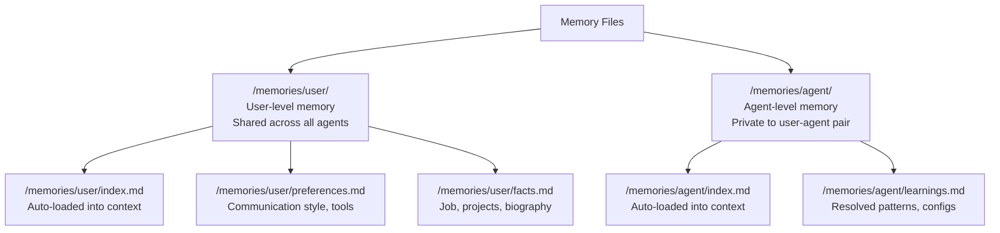

# Memory Module

## Purpose

Implements **file-based persistent memory** for AI agents. Agents can read and write markdown files to `/memories/user/` (user-level, shared across all agents) and `/memories/agent/` (agent-level, private to the user-agent pair). Memory survives server restarts because it's backed by MongoDB.

## Location

`src/modules/memory/`

## Structure

```
src/modules/memory/
├── index.js                # Barrel exports
├── memory.routes.js        # REST API routes
├── memory.controller.js    # HTTP handlers
├── memory.service.js       # Business logic
├── memory-file.model.js    # Mongoose schema for memory files
└── memory-files-store.js   # StoreBackend for Deep Agent filesystem
```

## Responsibilities

- CRUD operations for memory files
- Memory filesystem integration with Deep Agents
- User-level and agent-level memory namespacing
- Memory data persistence across conversations

## Data Model (MemoryFile)

| Field       | Type            | Description                             |
| ----------- | --------------- | --------------------------------------- |
| `ownerId`   | ObjectId (User) | Memory owner                            |
| `namespace` | String          | Memory scope (user/agent)               |
| `key`       | String          | Memory key/path                         |
| `content`   | String          | Memory file content                     |
| `version`   | Number          | Version counter for conflict resolution |

## Memory Namespaces



## Public API

| Method   | Path                  | Auth     | Purpose              |
| -------- | --------------------- | -------- | -------------------- |
| `GET`    | `/api/v1/memory`      | Required | List memory files    |
| `PUT`    | `/api/v1/memory/file` | Required | Write a memory file  |
| `DELETE` | `/api/v1/memory/file` | Required | Delete a memory file |
| `DELETE` | `/api/v1/memory/all`  | Required | Clear all memory     |

## Filesystem Integration

The `MemoryFilesStore` implements Deep Agents' `StoreBackend` interface, which allows the agent to:

- **Read files** — Via `read_file` tool
- **Write files** — Via `write_file` tool
- **Edit files** — Via `edit_file` tool
- **Delete files** — Via `delete_file` tool

The store is composited with other backends in `agent.factory.js`:

```javascript
const backend = new CompositeBackend()
  .withNamespace('workspace', ephemeralState)
  .withNamespace('memories', memoryFilesStore) // Persistent
  .withNamespace('skills', agentSkillsStore) // Read-only
  .withNamespace('skill-library', skillLibraryStore); // Read-write
```

### Auto-Loaded Files

- `/memories/user/index.md` — User memory index (auto-loaded every conversation)
- `/memories/agent/index.md` — Agent memory index (auto-loaded every conversation)

The system prompt instructs agents to keep these as indexes with one-line pointers, not dumping grounds.

## Dependencies

| Dependency          | Type     | Purpose                |
| ------------------- | -------- | ---------------------- |
| Auth module         | Internal | Authentication         |
| Rate Limiter module | Internal | Rate limiting          |
| Deep Agents         | External | StoreBackend interface |

## Important Business Rules

### Memory Persistence

Unlike the ephemeral `InMemoryStore` used previously in the old architecture, the current memory implementation uses MongoDB-backed storage. Memory survives server restarts, deployments, and nodemon reloads.

### Namespace Routing

The `memory-files-store.js` implements namespace-based routing:

- `userMemoryNamespace(userId)` → User-level memory (shared across all agents for this user)
- `agentMemoryNamespace(agentId, userId)` → Agent-level memory (specific to this user-agent pair)

### Agent Memory via Agent Routes

Agents can also access memory through the agents routes:

- `GET /api/v1/agents/:id/memory` — Get agent-specific memory
- `DELETE /api/v1/agents/:id/memory/:key` — Delete a specific memory key
