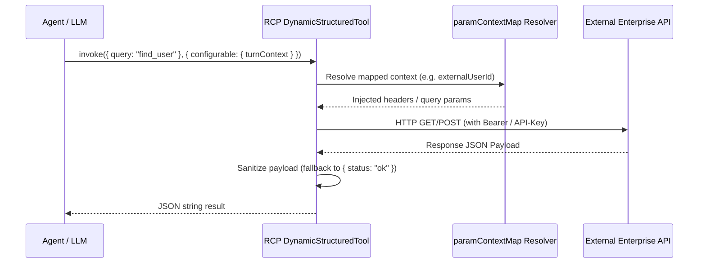

# RCP Sources Module

## Purpose

Implements the **REST Connector Protocol (RCP)** integration via `rcp-sdk`. RCP sources allow agents to dynamically discover tool manifests from external HTTPS endpoints at runtime, bind them to LangGraph / LangChain tool calling loops, and resolve dynamic runtime variables (`paramContextMap`) from caller context (`turnContext`) without leaking internal secrets or parameters to LLM prompts.

## Location

`src/modules/rcpSources/`

## Structure

```
src/modules/rcpSources/
├── index.js                     # Barrel exports
├── rcpSource.model.js           # Mongoose schema for RCP sources
├── rcpSource.repository.js      # Database operations
├── rcpSource.service.js         # Business logic & manifest discovery
├── rcpSource.tools.js           # DynamicStructuredTool creation & turnContext resolvers
└── rcpSource.validator.js       # Zod schemas for manifests & configuration
```

## Responsibilities

- **Dynamic Manifest Discovery**: Polls external endpoints at `/manifest` or configured URLs using `rcp-sdk.discover()`.
- **Schema Loosening & Tool Mapping**: Transforms RCP JSON schema parameters into sanitized LangChain `DynamicStructuredTool` instances.
- **Context Parameter Inversion (`paramContextMap`)**: Maps runtime properties (e.g. `userId`, `callerPhone`, `orderId`) directly into outbound HTTP requests using `configurable.turnContext`, hiding them from the LLM prompt.
- **Output Sanitization**: Guarantees that empty or undefined tool returns serialize to valid JSON or strings (`{ status: "ok" }`) to protect Gemini and LangGraph message invariants.
- **Security & Authorization**: Enforces project-level isolation and API key header injection for authenticated external APIs.

## Request Flow



## Public API & Endpoints

Mounted under `/api/v1/developer/projects/{projectId}/rcp-sources`:

| Method | Path | Auth | Purpose |
| --- | --- | --- | --- |
| `GET` | `/` | ProjectAdmin | List RCP sources in project |
| `POST` | `/` | ProjectAdmin | Register new RCP source & discover tools |
| `GET` | `/{id}` | ProjectAdmin | Get RCP source details & cached tools |
| `PUT` | `/{id}` | ProjectAdmin | Update RCP source configuration |
| `DELETE`| `/{id}` | ProjectAdmin | Delete RCP source |
| `POST` | `/{id}/test` | ProjectAdmin | Test connection and re-fetch manifest |

## Dependencies

| Dependency | Type | Purpose |
| --- | --- | --- |
| `rcp-sdk` | External | Manifest discovery, JSON schema parsing, and execution client |
| `@langchain/core` | External | `DynamicStructuredTool` creation |
| `agui` / `voice` | Internal | Provides live `turnContext` for runtime parameter resolution |
