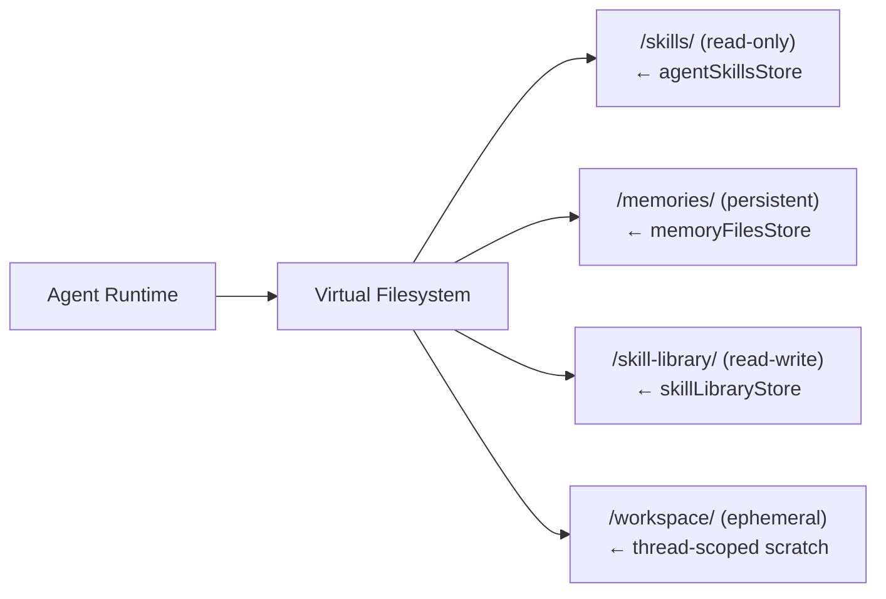

# Skills Module

## Purpose

Manages **AI agent skills** — reusable packages of instructions, reference materials, and files that teach agents domain-specific expertise. Skills are mounted as a read-only filesystem in the agent's virtual workspace.

## Location

`src/modules/skills/`

## Structure

```
src/modules/skills/
├── index.js                 # Barrel exports
├── skill.routes.js          # REST API routes
├── skill.controller.js      # HTTP handlers
├── skill.service.js         # Business logic
├── skill.repository.js      # Database access
├── skill.model.js           # Mongoose schema
├── skill.validator.js       # Zod validation schemas
├── agentSkillsStore.js      # Agent-level skill filesystem
├── skillLibraryStore.js     # Shared skill library store
├── skillMarkdown.js         # SKILL.md file builders
├── skillValidation.js       # File path/content validation
└── architectSkill.js        # Architect's built-in skill
```

## Responsibilities

- CRUD operations for skills
- Skill search (public + user's own)
- Skill file management (bundled reference files)
- Skill library store for agent filesystem
- Built-in Architect skill for agent creation
- Markdown rendering and slug generation

## Data Model (Skill)

| Field | Type | Description |
|-------|------|-------------|
| `ownerId` | ObjectId (User) | Skill owner |
| `name` | String (2-64, lowercase, hyphens) | Skill name |
| `description` | String (1024) | Skill description |
| `instructions` | String (50000) | SKILL.md body content |
| `files` | [File] | Bundled reference files |
| `isPublic` | Boolean | Public visibility flag |

Each file entry:
| Field | Type | Description |
|-------|------|-------------|
| `path` | String | Relative path (can be nested) |
| `content` | String | File content |
| `mimeType` | String | Content type |
| `createdAt` | Date | Creation timestamp |
| `updatedAt` | Date | Last modified |

## How Skills Work

When an agent has attached skills, the skill content is mounted as a read-only filesystem:

```
/skills/<skill-name>/
├── SKILL.md           # Main instructions (from instructions field)
└── references/        # Bundled reference files
    ├── api.md
    └── examples.js
```

The filesystem is served through the Deep Agent's `CompositeBackend`:



## Public API

| Method | Path | Auth | Purpose |
|--------|------|------|---------|
| `GET` | `/api/v1/skills/search` | Required | Search skills |
| `GET` | `/api/v1/skills/public` | Required | List public skills |
| `GET` | `/api/v1/skills` | Required | List user's own skills |
| `POST` | `/api/v1/skills` | Required | Create skill |
| `GET` | `/api/v1/skills/:id` | Required | Get skill details |
| `GET` | `/api/v1/skills/:id/agents` | Required | List agents using this skill |
| `PATCH` | `/api/v1/skills/:id` | Required | Update skill |
| `DELETE` | `/api/v1/skills/:id` | Required | Delete skill |

## Dependencies

| Dependency | Type | Purpose |
|-----------|------|---------|
| Auth module | Internal | Authentication |
| Rate Limiter module | Internal | Rate limiting |

## Important Business Rules

### Skill Name Constraints
- Must be lowercase, containing only `[a-z0-9-]`
- Unique per owner (cannot have two skills with the same name)
- 2-64 characters

### Skill Files
- Files are validated by `skillValidation.js`
- File paths can be nested (e.g., `references/api.md`)
- Allowed MIME types are validated
- Content length limits are enforced

### Agent Skills Store
The `agentSkillsStore` provides a read-only `BaseStore` facade that serves each agent's attached skills as a filesystem. The Architect agent has a static hardcoded skill injected at startup.

### Skill Library
The `skillLibraryStore` provides a read-write store for the Architect agent to create and manage skill files directly through its filesystem tools. The library is namespaced per-user.
