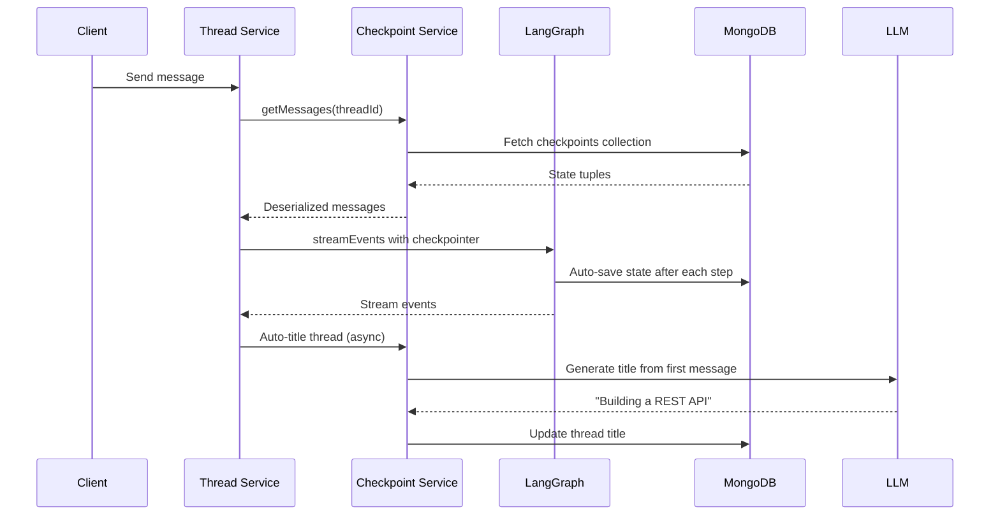

# Threads Module

## Purpose

Manages **conversation threads** — the persistent chat sessions between users and AI agents. Handles thread CRUD, message history retrieval, LangGraph checkpointing for stateful conversations, and auto-titling.

## Location

`src/modules/threads/`

## Structure

```
src/modules/threads/
├── index.js                   # Barrel exports
├── thread.routes.js           # REST API routes
├── thread.controller.js       # HTTP handlers
├── thread.repository.js       # Database access
├── thread.model.js            # Mongoose schema
├── thread.validator.js        # Zod validation schemas
└── checkpoint.service.js      # LangGraph checkpoint management
```

## Responsibilities

- Thread CRUD (create, list, get, delete individual, delete all)
- Thread title management with auto-titling
- Message history retrieval (via LangGraph checkpoints)
- Thread last-message-at touch tracking
- Subagent activity trace persistence
- Thread archiving and cleanup for inactive user deletion

## Data Model (Conversation / Thread)

| Field            | Type                                 | Description                                              |
| ---------------- | ------------------------------------ | -------------------------------------------------------- |
| `agentId`        | ObjectId (Agent)                     | Agent this thread belongs to                             |
| `userId`         | ObjectId (User)                      | Thread owner                                             |
| `threadId`       | String (unique)                      | LangGraph thread identifier                              |
| `title`          | String (default: "New Conversation") | Display title                                            |
| `lastMessageAt`  | Date                                 | Last activity timestamp                                  |
| `isArchived`     | Boolean                              | Archive flag                                             |
| `subagentTraces` | Mixed                                | Persisted subagent activity (keyed by task tool call ID) |

## Checkpoint System

Threads use LangGraph's `MongoDBSaver` checkpointer to persist the entire graph state after every execution step. This enables:

- **Multi-turn conversations** — State is preserved between messages
- **Human-in-the-loop** — Graph can pause and resume at interrupts
- **Time travel** — State history is maintained (though not exposed via API)



## Public API

| Method   | Path                           | Auth     | Purpose                   |
| -------- | ------------------------------ | -------- | ------------------------- |
| `POST`   | `/api/v1/threads`              | Required | Create thread             |
| `GET`    | `/api/v1/threads`              | Required | List user's threads       |
| `GET`    | `/api/v1/threads/:id`          | Required | Get thread details        |
| `DELETE` | `/api/v1/threads`              | Required | Delete all user's threads |
| `DELETE` | `/api/v1/threads/:id`          | Required | Delete single thread      |
| `PATCH`  | `/api/v1/threads/:id/title`    | Required | Update title              |
| `GET`    | `/api/v1/threads/:id/messages` | Required | Get message history       |

## Dependencies

| Dependency                                | Type     | Purpose                                      |
| ----------------------------------------- | -------- | -------------------------------------------- |
| Auth module                               | Internal | Authentication                               |
| Rate Limiter module                       | Internal | Rate limiting                                |
| Mongoose                                  | External | Database access                              |
| `@langchain/langgraph-checkpoint-mongodb` | External | LangGraph checkpointer                       |
| MongoDB driver                            | External | Direct MongoDB access for checkpoint queries |

## Important Business Rules

### All Thread Routes Require Auth

All thread endpoints are behind `authMiddleware`. Chatting is tied to account quotas/ownership.

### Deterministic Thread IDs

When threads are created through AG-UI, the `threadId` follows the pattern `agui-<agentId>-<userId>` for deterministic routing.

### Checkpoint Storage

Checkpoints are stored in two MongoDB collections:

- `checkpoints` — Graph state after each step
- `checkpoint_writes` — Individual writes within a checkpoint

These are managed by `@langchain/langgraph-checkpoint-mongodb`.

### Message History Retrieval

`checkpointService.getMessages(threadId)` replays the graph state to extract the message list. It does not store messages in a separate collection — they're embedded in the checkpoint.

### Auto-Titling

When a thread title is "New Conversation" and the first message arrives, the service asynchronously calls the LLM to generate a concise title. This is done in the background after the streaming response starts.

### Subagent Trace Persistence

`subagentTraces` on the thread model stores folded subagent activity (text deltas, tool calls, tool results) so they survive page reloads. These are folded from the live AG-UI stream events.

### Cleanup on User Deletion

When a user is deleted (via cron or admin), all their threads and associated checkpoints are cleaned up to prevent orphaned data.
