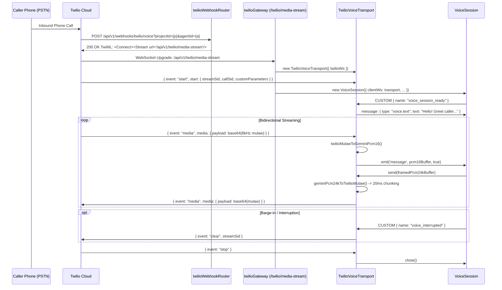

# Twilio Module

## Purpose

Bridges traditional telephone calls (PSTN / mobile telephony) to real-time AI voice agents. The Twilio module receives inbound phone calls via Twilio Voice webhooks, initiates outbound phone calls to users, and manages bidirectional audio streaming between Twilio Media Streams (8kHz μ-law) and Gemini Live (16kHz/24kHz linear PCM).

## Location

`src/modules/twilio/`

## Structure

```
src/modules/twilio/
├── index.js                     # Barrel exports & route attachments
├── twilio.constants.js          # Default greetings, status codes, timing constants
├── twilio.service.js            # Outbound calls, TwiML generation, and secret resolution
├── audioConverter.js            # Bidirectional μ-law 8kHz <-> Linear PCM 16/24kHz transcoding
├── TwilioVoiceTransport.js      # Custom EventEmitter adapter bridging Twilio WS to VoiceSession
├── twilioGateway.js             # HTTP Upgrade handler on /api/v1/twilio/media-stream
├── twilioWebhook.controller.js  # Twilio Voice and Status callback HTTP handlers
├── twilioWebhook.routes.js      # /api/v1/webhooks/twilio routes
├── outboundCall.controller.js   # Outbound PSTN calling HTTP handlers
└── outboundCall.routes.js       # /api/v1/twilio routes
```

## Responsibilities

- **Telephony Webhook Ingestion**: Receives Twilio Voice call events (`POST /api/v1/webhooks/twilio/voice`) and generates TwiML `<Connect><Stream>` instructions to establish Media Stream WebSockets.
- **Outbound Voice Calling**: Triggers automated agent phone calls via the Twilio REST API using multi-tenant credentials resolved per-project.
- **Audio Transcoding**: Converts 8kHz μ-law audio packets from Twilio into 16kHz linear PCM for Gemini, and resamples 24kHz Gemini output to 8kHz μ-law with proper byte chunking (160 bytes per 20ms frame).
- **Smooth Audio Pacing & Jitter Smoothing**: Uses a 20ms pacing queue with an adaptive high-water mark (`MAX_OUTBOUND_QUEUE_CHUNKS = 250`) to buffer audio smoothly and drop stale chunks during congestion.
- **Telephony Barge-In Clearing**: Immediately clears Twilio's remote playback buffer upon receiving a `voice_interrupted` event by transmitting a Twilio `{ event: 'clear' }` packet.
- **Thread & Context Continuity**: Tracks external users by phone number (`externalUserService.resolveOrCreate`), establishes persistent conversation threads (`agui-${domain}-${agentId}-${callerPhone}`), and injects caller phone and `callSid` into agent `turnContext`.

## Request Flow



## Public API & Endpoints

| Method     | Path                             | Auth                      | Purpose                                                              |
| ---------- | -------------------------------- | ------------------------- | -------------------------------------------------------------------- |
| `POST`     | `/api/v1/webhooks/twilio/voice`  | Public (Twilio Signature) | Inbound call webhook; returns TwiML with `<Stream>` configuration    |
| `POST`     | `/api/v1/webhooks/twilio/status` | Public (Twilio Signature) | Call progress/status tracking webhook (ringing, answered, completed) |
| `POST`     | `/api/v1/twilio/call`            | ProjectAdmin / Clerk      | Triggers outbound phone call from project agent to target number     |
| `GET (WS)` | `/api/v1/twilio/media-stream`    | Stream Handshake          | Bidirectional audio streaming WebSocket gateway                      |

## Dependencies

| Dependency             | Type     | Purpose                                                              |
| ---------------------- | -------- | -------------------------------------------------------------------- |
| `voice` module         | Internal | Supplies `VoiceSession`, provider resolution, and live configuration |
| `projects` module      | Internal | Resolves encrypted `TWILIO_*` project secrets                        |
| `externalUsers` module | Internal | Maps caller phone numbers to external user identities                |
| `threads` module       | Internal | Persists cross-call conversation history                             |
| `twilio` SDK           | External | REST client for placing outbound calls                               |
