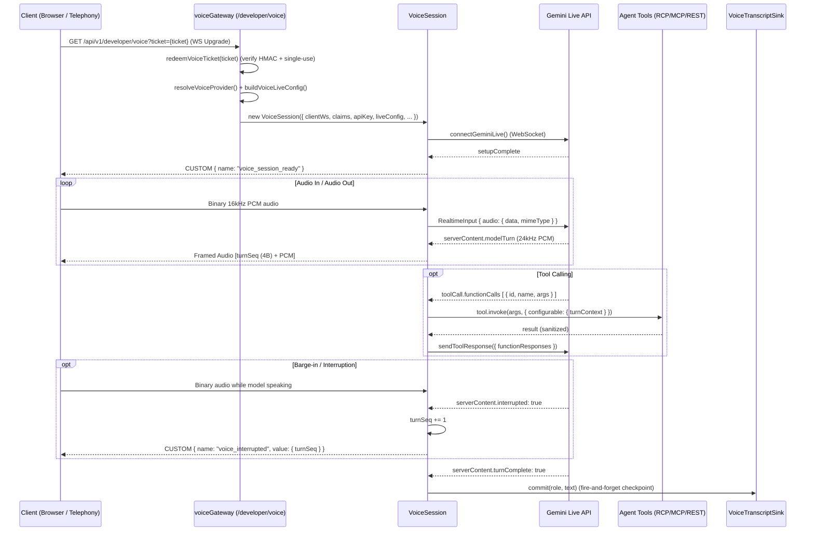

# Voice Module

## Purpose

Implements real-time bidirectional voice agent interaction using the **Gemini Multimodal Live API** (`gemini-3.1-flash-live-preview`). The voice module bridges client WebSocket connections (both browser and telephony) to upstream AI voice models with sub-second speech-to-speech latency, automated voice activity detection (VAD), barge-in handling, dynamic tool calling, and session resumption.

## Location

`src/modules/voice/`

## Structure

```
src/modules/voice/
├── index.js                               # Barrel exports
├── voice.constants.js                     # Sample rates, mime types, timeouts, close reasons
├── voice.service.js                       # Provider resolution, tool collection & Live config builder
├── voiceTicket.service.js                 # HMAC-SHA256 signed single-use ticket minting & redemption
├── voiceThread.service.js                 # Thread ownership assertions & conversation history seeding
├── voiceTranscriptSink.js                 # Fire-and-forget turn accumulation and thread checkpointing
├── voiceEventSchemas.js                   # Zod schemas for voice tickets and WebSocket messages
├── developerVoice.controller.js           # ProjectRuntime ticket minting endpoint
├── developerVoice.routes.js               # Machine voice ticket router
├── projectAgentVoiceTest.controller.js    # ProjectAdmin ticket minting endpoint
├── projectAgentVoiceTest.routes.js        # Studio test ticket router
└── gateway/
    ├── audioFraming.js                    # 4-byte LE turnSeq header framing for client PCM audio
    ├── geminiLiveClient.js                # Upstream WebSocket connection manager
    ├── voiceGateway.js                    # HTTP Upgrade handler on /api/v1/developer/voice
    └── VoiceSession.js                    # Bidirectional audio bridge, VAD, barge-in, tools & lifecycle
```

## Responsibilities

- **Single-Use Ticket Authentication**: Issues signed HMAC-SHA256 tickets with 60s TTL over authenticated HTTP to authenticate WebSocket upgrades.
- **Upstream Gemini Live Bridging**: Manages 16kHz linear PCM input audio framing and 24kHz linear PCM model output streaming.
- **Audio Framing & Pacing**: Prepends a 4-byte little-endian `turnSeq` counter to outgoing audio frames to permit client-side and telephony buffer drops on barge-in.
- **Barge-In / Interruption Handling**: Detects user speech interrupting the model, increments `turnSeq`, cancels pending generation, and broadcasts `voice_interrupted`.
- **Dynamic Tool Calling**: Executes parallel function calls with a 15-second timeout, passes live `turnContext` for runtime parameter resolution, sanitizes return values, and returns unified batch responses.
- **Transparent Resumption**: Consumes `sessionResumptionUpdate` handles and handles `goAway` frames to proactively reconnect before deadline without dropping user sessions.
- **Transcript Persistence**: Accumulates incremental output fragments into unified sentences and writes conversation turns into MongoDB checkpoints via `VoiceTranscriptSink`.

## Request Flow



## Public API & Endpoints

| Method | Path | Auth | Purpose |
| --- | --- | --- | --- |
| `POST` | `/api/v1/developer/projects/{projectId}/agents/{agentId}/voice/test` | ProjectAdmin | Mint single-use voice ticket for Studio agent testing |
| `POST` | `/api/v1/developer/projects/{projectId}/agents/{agentId}/voice/ticket` | ProjectRuntime | Mint single-use voice ticket for end-user runtime application |
| `GET (WS)` | `/api/v1/developer/voice?ticket={ticket}` | Ticket Query | Upgrade WebSocket connection to initiate real-time `VoiceSession` |

## Dependencies

| Dependency | Type | Purpose |
| --- | --- | --- |
| `agents` module | Internal | Agent configuration, instructions, and tool attachment |
| `providers` module | Internal | Resolves active Google Gemini provider credentials |
| `threads` module | Internal | Thread checkpointing and seed excerpt generation |
| `auth` module | Internal | Principal context validation (`ProjectAdmin`, `ProjectRuntime`) |
| `@google/genai` / WebSocket | External | Upstream communication with Gemini Multimodal Live API |
