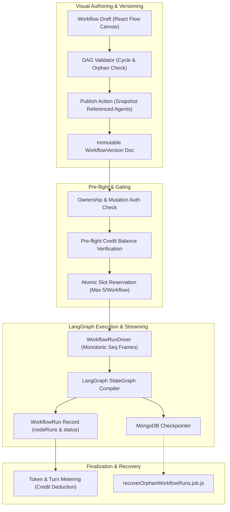

# Workflows Module

## Purpose

Implements the **Workflows Engine** — a visual, declarative Directed Acyclic Graph (DAG) orchestration platform built on top of **LangGraph**. Workflows allow multi-agent pipelines, conditional routing, tool execution, knowledge base retrieval, and human-in-the-loop approvals to be composed visually and executed with enterprise-grade durability, checkpointing, orphan run recovery, and real-time streaming.

## Location

`src/modules/developer/workflows/`

## Structure

```
src/modules/developer/workflows/
├── index.js                             # Barrel exports & route attachments
├── workflow.model.js                    # Workflow draft, settings & active runs schema
├── workflowVersion.model.js             # Immutable published version snapshots
├── workflowRun.model.js                 # Run execution records, node telemetry & outputs
├── workflow.repository.js               # Workflow persistence & atomic concurrency reservation
├── workflowVersion.repository.js        # Version snapshot storage & retrieval
├── workflowRun.repository.js            # Run tracking, status transitions & node metrics
├── workflow.service.js                  # Workflow lifecycle, authorization, publish & execution
├── workflowUsage.service.js             # Token metering, agent turn tracking & credit deduction
├── workflow.factory.js                  # LangGraph StateGraph compiler & node executors
├── workflowRunDriver.js                 # In-memory streaming driver with monotonic event sequencing
├── templateResolver.js                  # Mustache-style template variable interpolation ({{step.output}})
├── workflowMermaid.js                   # Flowchart export to Mermaid syntax
├── workflow.validator.js                # Zod schemas, cycle detection & node config validation
├── workflow.controller.js               # REST & SSE streaming HTTP handlers
└── workflow.routes.js                   # Express route registrations
```

## Supported Node Types

| Node Type | Purpose | Configuration & Semantics |
| --- | --- | --- |
| `trigger` | Graph entry point | Ingests initial event or manual input payload |
| `agentStep` | AI Agent execution | Invokes agent graph with prompt template; streams AG-UI events |
| `toolStep` | Direct tool invocation | Executes REST endpoints, webhooks, or registered tools with input |
| `knowledgeStep`| Semantic search / RAG | Queries Qdrant vector database collection with template query |
| `condition` | Dynamic branching | Evaluates expressions and routes to `true` or `false` edges |
| `approval` | Human-in-the-Loop | Pauses graph execution pending external human confirmation |
| `parallel` | Concurrent fan-out | Dispatches tasks simultaneously to multiple child branches |
| `join` | Barrier synchronization | Aggregates outputs from parallel branches before proceeding |
| `output` | Graph exit point | Structures final workflow response and surfaces top-level output |

## Workflow Lifecycle & Architecture



## Public API & Endpoints

All routes are mounted under `/api/v1/developer/projects/{projectId}/workflows`:

| Method | Path | Auth | Purpose |
| --- | --- | --- | --- |
| `GET` | `/` | ProjectAdmin / Runtime | List project workflows |
| `POST` | `/` | ProjectAdmin / Runtime | Create new workflow draft |
| `GET` | `/{id}` | ProjectAdmin / Runtime | Retrieve workflow details & draft |
| `PUT` | `/{id}` | ProjectAdmin / Owner | Update workflow metadata & settings |
| `PUT` | `/{id}/draft` | ProjectAdmin / Owner | Save visual canvas draft (nodes & edges) |
| `DELETE`| `/{id}` | ProjectAdmin / Owner | Delete workflow |
| `POST` | `/{id}/publish` | ProjectAdmin / Owner | Publish immutable version snapshot |
| `GET` | `/{id}/versions` | ProjectAdmin / Runtime | List published versions |
| `GET` | `/{id}/versions/{version}` | ProjectAdmin / Runtime | Retrieve specific published version |
| `GET` | `/{id}/mermaid` | ProjectAdmin / Runtime | Export workflow DAG as Mermaid diagram |
| `POST` | `/{id}/run` | ProjectAdmin / Runtime | Execute workflow (supports SSE streaming) |
| `GET` | `/{id}/runs` | ProjectAdmin / Runtime | List execution history for workflow |
| `GET` | `/runs/{runId}` | ProjectAdmin / Runtime | Get run details and node run metrics |
| `GET` | `/runs/{runId}/resume` | ProjectAdmin / Runtime | Re-attach to live SSE stream or snapshot |
| `POST` | `/runs/{runId}/abort` | ProjectAdmin / Runtime | Abort running workflow execution |

## Key Architectural Guarantees

1. **Deterministic Cycle Prevention**: Uses depth-first traversal to reject circular dependencies before drafts can be saved or published.
2. **Immutable Version Snapshots**: Publishing freezes the exact prompt, model name, and tool signatures of all referenced agents (`agentSnapshots`) to protect workflows from external agent mutations.
3. **Atomic Concurrency Gating**: Restricts concurrent executions per workflow (default 5) via atomic MongoDB `$inc` operations to protect shared infrastructure.
4. **Decoupled Event Streaming**: `WorkflowRunDriver` maintains an in-memory frame buffer with monotonic sequence numbers (`seq`). Clients that disconnect can reconnect via `/resume?sinceSeq=N` without losing events.
5. **Dry-Run Security**: Dry runs strip all mutating external tools (`mcps`, `restApiTools`, `rcpSources`) and bypass balance deductions, enabling risk-free validation.
6. **Orphan Run Crash Recovery**: If a server process terminates mid-execution, `recoverOrphanWorkflowRuns.job.js` detects interrupted runs and resumes them from their latest MongoDB checkpoint tuple.
