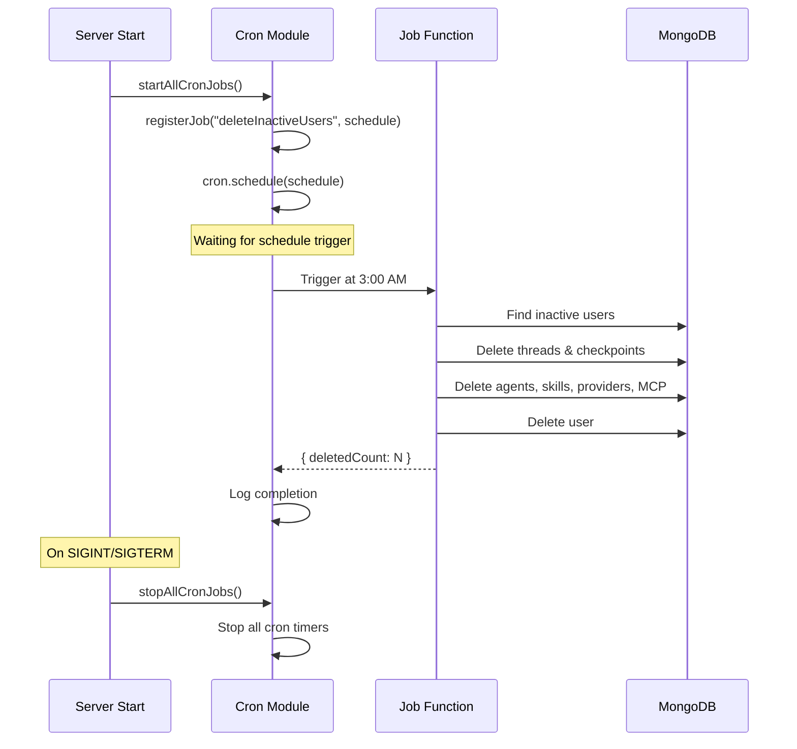

# Background Jobs

## Overview

Background jobs are managed using `node-cron`. Jobs are registered on server startup and run on configurable schedules.

## Job Lifecycle



## Registered Jobs

### deleteInactiveUsers

| Property | Value |
|----------|-------|
| **Schedule** | Daily at 3:00 AM (`0 3 * * *`) |
| **Module** | `src/modules/cron/deleteInactiveUsers.js` |
| **Config** | `CRON_DELETE_INACTIVE_USERS` (schedule), `ACCOUNT_RETENTION_DAYS` (retention) |

**What it does:**
1. Finds users marked as `isActive: false` past the retention period (default 30 days)
2. For each user:
   a. Deletes LangGraph checkpoints
   b. Deletes conversation threads
   c. Deletes agents, skills, providers, MCP servers
   d. Deletes MCP user connections
   e. Deletes the user document
3. Logs the total deleted count

## Configuring Schedules

Schedules follow the standard cron format:

```
* * * * *
│ │ │ │ │
│ │ │ │ └── Day of week (0-7, 0 = Sunday)
│ │ │ └──── Month (1-12)
│ │ └────── Day of month (1-31)
│ └──────── Hour (0-23)
└────────── Minute (0-59)
```

Examples:
- `0 3 * * *` — Daily at 3:00 AM
- `0 */6 * * *` — Every 6 hours
- `*/30 * * * *` — Every 30 minutes

## Disabling All Jobs

Set in environment:

```env
DISABLE_CRON=true
```

When disabled, each job logs: `Cron job "<name>" disabled via DISABLE_CRON`

## Graceful Shutdown

All cron jobs are stopped during graceful shutdown to prevent open handles:

```javascript
process.on('SIGINT', () => {
  logger.info('SIGINT received, shutting down gracefully...');
  stopAllCronJobs();
  database.closeConnection().then(() => process.exit(0));
});
```

## Adding a New Job

1. Create the job function in `src/modules/cron/`
2. Register it in `src/modules/cron/index.js`:

```javascript
import myNewJob from './myNewJob.js';

function startAllCronJobs() {
  registerJob('myNewJob', config.cron.mySchedule, myNewJob);
}
```

3. Add the schedule config in `src/config/index.js`:

```javascript
cron: {
  mySchedule: process.env.CRON_MY_SCHEDULE || '0 0 * * *',
}
```

## Error Handling

Jobs automatically catch and log errors:

```javascript
const job = cron.schedule(schedule, async () => {
  logger.info(`Cron job "${name}" started`);
  try {
    await task();
    logger.info(`Cron job "${name}" completed`);
  } catch (error) {
    logger.error(`Cron job "${name}" failed:`, error);
  }
});
```

A single job failure does not affect other jobs or disable the cron timer.
