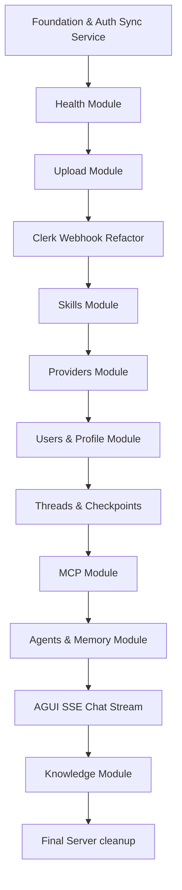

# 07 - Migration Plan

This document maps the step-by-step migration roadmap to refactor the technical-layered Express codebase into a modular feature-based architecture without causing service disruptions, breaking API compatibility, or introducing regressions.

---

## 1. Safety Rules & Verification Strategy

During every migration step, the developer must:
1. **Incremental Changes**: Work on one module at a time. Do not attempt a single large commit/PR.
2. **Import Fixing**: Always update references. Use absolute-like module resolution or relative paths accurately.
3. **Continuous Testing**: After every step, run the following verification sequence:
   * **Jest Test Suite**: `pnpm test` (Must achieve 100% pass)
   * **Prettier formatting**: `pnpm run format`
   * **Verification Stack**: `pnpm run ai:verify`
4. **Rollback Trigger**: If tests break and imports become circular, revert using `git checkout` or `git reset --hard` before proceeding.

---

## 2. Refactoring Roadmap

We will migrate in order from lowest risk/foundational elements to the highest complexity modules.

---

## 3. Migration Steps Detail

### Step 1: Create Module Folder Structures & Extract Auth Sync Service
* **Objective**: Create `src/modules/` domain subdirectories. Colocate auth middleware and consolidate the duplicate Clerk user synchronization logic into `auth.service.js`.
* **Files Created**:
  * `src/modules/auth/auth.service.js`
* **Files Moved**:
  * `src/middlewares/auth.middleware.js` ──> `src/modules/auth/auth.middleware.js`
  * `src/middlewares/optionalAuthMiddleware.js` ──> `src/modules/auth/optional-auth.middleware.js`
  * `src/middlewares/admin.middleware.js` ──> `src/modules/users/admin.middleware.js`
* **Risks**: High risk of breaking auth on all protected routes if imports are misconfigured.
* **Verification**: Run `pnpm test`. Verify `/api/v1/profile` with valid/invalid Clerk tokens returns correct status.

### Step 2: Health Module Migration
* **Objective**: Move all health files under `src/modules/health/`. Low-risk testing of the folder layout.
* **Files Moved**:
  * `src/routes/health.js` ──> `src/modules/health/health.routes.js`
  * `src/controllers/healthController.js` ──> `src/modules/health/health.controller.js`
  * `src/services/healthService.js` ──> `src/modules/health/health.service.js`
  * `src/repositories/healthRepository.js` ──> `src/modules/health/health.repository.js`
* **Verification**: Run `pnpm test`. Invoke `/api/v1/health` and `/api/v1/health/db`.

### Step 3: Upload Module Migration
* **Objective**: Colocate upload controllers/routes.
* **Files Moved**:
  * `src/routes/upload.routes.js` ──> `src/modules/upload/upload.routes.js`
* **Verification**: Verify image avatar uploading still returns successfully.

### Step 4: Clerk Webhook Domain Refactoring
* **Objective**: Separate svix signature verification, payload parsing, and MongoDB modifications into proper routes, controller, and service files. Use `userRepository` for CRUD.
* **Files Created**:
  * `src/modules/webhooks/webhook.controller.js`
  * `src/modules/webhooks/webhook.service.js`
* **Files Moved**:
  * `src/routes/webhook.routes.js` ──> `src/modules/webhooks/webhook.routes.js`
* **Verification**: Mock SVIX request payloads and run assertions against user synchronization triggers in database.

### Step 5: Skills Module Migration
* **Objective**: Relocate skills and remove the direct `Agent` Mongoose model query inside `SkillService` by delegating to `agentRepository`.
* **Files Moved**:
  * `src/routes/skill.routes.js` ──> `src/modules/skills/skill.routes.js`
  * `src/controllers/skill.controller.js` ──> `src/modules/skills/skill.controller.js`
  * `src/services/skill.service.js` ──> `src/modules/skills/skill.service.js`
  * `src/repositories/skillRepository.js` ──> `src/modules/skills/skill.repository.js`
  * `src/models/Skill.js` ──> `src/modules/skills/skill.model.js`
  * `src/validators/skill.validator.js` ──> `src/modules/skills/skill.validator.js`
* **Verification**: Verify CRUD actions against skill lists. Run `pnpm test`.

### Step 6: Providers Module Migration
* **Objective**: Colocate provider files and replace direct `Agent` model calls with `agentRepository` calls.
* **Files Moved**:
  * `src/routes/provider.routes.js` ──> `src/modules/providers/provider.routes.js`
  * `src/controllers/provider.controller.js` ──> `src/modules/providers/provider.controller.js`
  * `src/services/provider.service.js` ──> `src/modules/providers/provider.service.js`
  * `src/repositories/providerRepository.js` ──> `src/modules/providers/provider.repository.js`
  * `src/models/Provider.js` ──> `src/modules/providers/provider.model.js`
  * `src/validators/provider.validator.js` ──> `src/modules/providers/provider.validator.js`

### Step 7: Users & Profile Module Migration
* **Objective**: Modularize User profiles and administrative user modifications. Create a `UserService` to house profile deletion database transactions, eliminating direct model imports in the controller. Remove duplicate schema fields in `User` model.
* **Files Created**:
  * `src/modules/users/user.service.js`
* **Files Moved**:
  * `src/routes/profile.routes.js` ──> `src/modules/users/profile.routes.js`
  * `src/routes/admin.routes.js` ──> `src/modules/users/admin.routes.js`
  * `src/controllers/profile.controller.js` ──> `src/modules/users/profile.controller.js`
  * `src/controllers/admin.controller.js` ──> `src/modules/users/admin.controller.js`
  * `src/repositories/userRepository.js` ──> `src/modules/users/user.repository.js`
  * `src/models/User.js` ──> `src/modules/users/user.model.js`
  * `src/validators/profile.validator.js` ──> `src/modules/users/profile.validator.js`

### Step 8: Threads & Checkpoints Module Migration
* **Objective**: Modularize threads and checkpoints saver logic.
* **Files Moved**:
  * `src/routes/thread.routes.js` ──> `src/modules/threads/thread.routes.js`
  * `src/controllers/thread.controller.js` ──> `src/modules/threads/thread.controller.js`
  * `src/repositories/threadRepository.js` ──> `src/modules/threads/thread.repository.js`
  * `src/models/Conversation.js` ──> `src/modules/threads/conversation.model.js`
  * `src/validators/thread.validator.js` ──> `src/modules/threads/thread.validator.js`
  * `src/services/checkpoint.service.js` ──> `src/modules/threads/checkpoint.service.js`

### Step 9: MCP Module Migration
* **Objective**: Colocate MCP server resources. Remove direct `Agent` model queries inside `McpService`.
* **Files Moved**:
  * `src/routes/mcp.routes.js` ──> `src/modules/mcps/mcp.routes.js`
  * `src/controllers/mcp.controller.js` ──> `src/modules/mcps/mcp.controller.js`
  * `src/services/mcp.service.js` ──> `src/modules/mcps/mcp.service.js`
  * `src/services/mcpToken.service.js` ──> `src/modules/mcps/mcp-token.service.js`
  * `src/repositories/mcpRepository.js` ──> `src/modules/mcps/mcp.repository.js`
  * `src/repositories/mcpUserConnectionRepository.js` ──> `src/modules/mcps/mcp-user-connection.repository.js`
  * `src/models/Mcp.js` ──> `src/modules/mcps/mcp.model.js`
  * `src/models/McpUserConnection.js` ──> `src/modules/mcps/mcp-user-connection.model.js`
  * `src/validators/mcp.validator.js` ──> `src/modules/mcps/mcp.validator.js`

### Step 10: Agents & Memory Module Migration
* **Objective**: Colocate agents, templates, factory logic, and file memory handlers. Remove direct validation calls inside controller methods if already validated by routes.
* **Files Moved**:
  * `src/routes/agent.routes.js` ──> `src/modules/agents/agent.routes.js`
  * `src/controllers/agent.controller.js` ──> `src/modules/agents/agent.controller.js`
  * `src/services/agent.service.js` ──> `src/modules/agents/agent.service.js`
  * `src/repositories/agentRepository.js` ──> `src/modules/agents/agent.repository.js`
  * `src/models/Agent.js` ──> `src/modules/agents/agent.model.js`
  * `src/models/MemoryFile.js` ──> `src/modules/agents/memory-file.model.js`
  * `src/validators/agent.validator.js` ──> `src/modules/agents/agent.validator.js`
  * `src/factories/agentFactory.js` ──> `src/modules/agents/agent.factory.js`

### Step 11: AGUI SSE Chat Stream Refactoring
* **Objective**: Extract the massive stream generator function `runAgentAsAguiEvents` and event translator/collating blocks out of the routing file. Create `AguiController` and `AguiService` to represent routing and orchestration concerns respectively.
* **Files Created**:
  * `src/modules/agui/agui.controller.js`
  * `src/modules/agui/agui.service.js`
* **Files Moved**:
  * `src/routes/agui.routes.js` ──> `src/modules/agui/agui.routes.js`
* **Verification**: Verify SSE client stream connections and chat execution threads. Run `pnpm run ai:verify`.

### Step 12: Knowledge Module Migration
* **Objective**: Relocate knowledge bases, text splitters, and vector chunk indexing files.
* **Files Moved**:
  * `src/routes/knowledge.routes.js` ──> `src/modules/knowledge/knowledge.routes.js`
  * `src/controllers/knowledge.controller.js` ──> `src/modules/knowledge/knowledge.controller.js`
  * `src/services/knowledge.service.js` ──> `src/modules/knowledge/knowledge.service.js`
  * `src/repositories/knowledgeRepository.js` ──> `src/modules/knowledge/knowledge.repository.js`
  * `src/models/KnowledgeBase.js` ──> `src/modules/knowledge/knowledge-base.model.js`
  * `src/models/KnowledgeChunk.js` ──> `src/modules/knowledge/knowledge-chunk.model.js`
  * `src/validators/knowledge.validator.js` ──> `src/modules/knowledge/knowledge.validator.js`

### Step 13: Final Cleanup and Verification
* **Objective**: Remove any remaining files under original technical-layer root folders, fix app router mounts in `src/index.js`, double-check the final production build, format code, and check that no regressions exist.
* **Verification**: Run `pnpm test`, `pnpm run format`, `pnpm run ai:verify`. Ensure server boots successfully.
