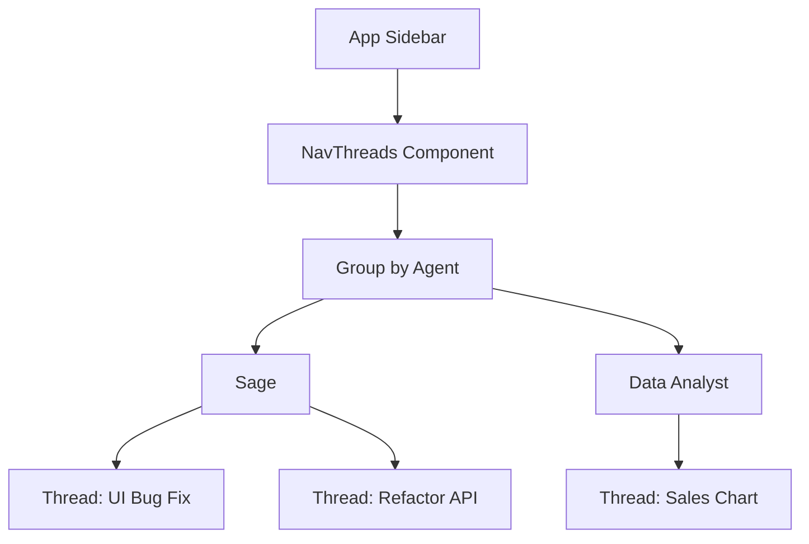

# Issue: Grouped Thread Management in Sidebar

## 📌 Status & Metadata
- **Title**: Unified Thread Management Grouped by Agent in Sidebar
- **Priority**: High 🚨
- **Type**: Feature / UX Improvement
- **Target Component**: Frontend (`AppSidebar`, `NavDocuments` / `NavThreads`) & API Integration

---

## 📖 Context & Motivation
Currently, the sidebar has a placeholder section named **"Threads"** (formerly "Knowledge Base") which takes an empty array of items. Users have no way to browse their existing chat threads or jump back into past conversations with different agents. 

To provide a seamless, premium orchestration experience, we need to implement a **unified thread explorer** in the sidebar. Conversations should be grouped by **Agent** (e.g., *Sage*, *Data Analyst*) to keep the workspace organized, and users must be able to rename, delete, or quickly select and switch between threads directly from the sidebar.

---

## 🎨 User Interface & Component Design



### 1. Grouping Mechanism
- Fetch all active user threads via `GET /threads`.
- Group the threads dynamically on the client side using the populated `agentId` data:
  ```javascript
  const grouped = threads.reduce((acc, thread) => {
    const agent = thread.agentId;
    if (!agent) return acc;
    const agentId = agent._id || agent.id;
    if (!acc[agentId]) {
      acc[agentId] = { agent, threads: [] };
    }
    acc[agentId].threads.push(thread);
    return acc;
  }, {});
  ```

### 2. UI Layout
- **Collapsible Groups**: Each agent forms a group that can be expanded/collapsed. Clicking the agent group header could toggle its visibility or navigate to the agent's main explore/run page.
- **Thread List**: Indented list under the agent heading displaying thread titles.
- **Active State**: The currently open thread (`threadId` matches the router params) is highlighted.
- **Quick Action Menu**: Hovering over a thread exposes a `MoreHorizontal` icon triggering a dropdown with options:
  - ✏️ **Rename Thread**: Inline text input to rename the thread.
  - 🗑️ **Delete Thread**: Destructive option that calls `deleteThread` and removes it from the list.

---

## 🛠️ API Integration Requirements

The following endpoints are already available in the backend and need to be integrated:

1. **Fetch Threads**: `GET /threads` (via `getThreads()`)
   - Returns: `{ success: true, data: Conversation[] }`
   - Populated fields: `agentId` contains `{ _id, name, avatar, slug }`.
2. **Rename Thread**: `PATCH /threads/:id/title` (via `updateThreadTitle(id, { title })`)
3. **Delete Thread**: `DELETE /threads/:id` (via `deleteThread(id)`)

---

## 📋 Implementation Checklist

### Phase 1: API & Hook Integration
- [ ] Create a custom React hook `useUserThreads` in `frontend/src/hooks/use-user-threads.js` to fetch and group threads.
- [ ] Implement caching or periodic refresh of threads when a new thread is created.

### Phase 2: Component Development
- [ ] Rename/Refactor `NavDocuments` to a new component named `NavThreads` inside `frontend/src/components/nav-threads.jsx` (or update `nav-documents.jsx` in-place).
- [ ] Build the collapsible accordion-like UI for agent groupings.
- [ ] Add the hover-to-expose dropdown menu with Rename and Delete actions.
- [ ] Integrate rename functionality (either a modal dialog or an inline editable input).

### Phase 3: Layout Integration
- [ ] Update `AppSidebar` (`frontend/src/components/app-sidebar.jsx`) to call the new thread hook and pass the grouped items to `NavThreads`.
- [ ] Ensure that when a user creates a new thread in the Agent Chat, the sidebar updates immediately.

### Phase 4: UX Polish
- [ ] Add loading skeletons while threads are fetching.
- [ ] Add empty states showing "No threads yet. Start a conversation!"
- [ ] Ensure full responsiveness and smooth transitions.
