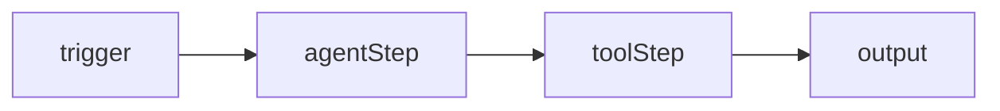

# Workflows — mental model

Workflows are **multi-agent DAGs** compiled to LangGraph `StateGraph` and executed via the AG-UI protocol.

## Graph

- **Nodes** — `trigger` (manual/api/webhook/schedule/chat), `agentStep`/`knowledgeStep`/`toolStep`, `condition`/`approval`/`parallel`/`join`/`output`. Each has `type`, `position`, `data: { label, config, retryPolicy, onError }`.
- **Edges** — `source → target` with optional `condition`/`sourceHandle`.
- **Trigger** — how a run starts (`manual` in Studio, `api`/`webhook`/`schedule` in production).

## Draft vs Published

- **Draft** — editable canvas (`nodes`, `edges`, `trigger`) saved via `workflows.saveDraft`.
- **PublishedVersion** — immutable snapshot (`version`, `definition`, `agentSnapshots`) created via `workflows.publish`. `activeRuns` counts in-flight runs.

Export via `workflows.getMermaid(workflowId)` → Mermaid flowchart markdown.

## Run lifecycle

`workflows.run` / `workflows.stream` → `WorkflowRun { _id, status: queued|running|paused|completed|failed|cancelled, nodeRuns: NodeRun[], output, usage, threadId }`.

- **Stream** yields `workflow_node_started` → `TEXT_MESSAGE_CHUNK`/`TOOL_CALL_*` (with `parentStepId`) → `workflow_node_completed` → `RUN_FINISHED`, each with monotonic `seq` for `resumeStream(runId, sinceSeq)`.
- **Dry run** (`dryRun: true`) intercepts destructive tools, bypasses credit checks.
- **Cancel** via `workflows.cancel(runId)` aborts `AbortController` and emits `RUN_ERROR: EXECUTION_CANCELLED`.

See [SDK Workflows guide](/docs/sdk/v0.9.0/guides/workflows) and [Runtime Workflows](/docs/runtime/v0.11.0/types) for execution details.
