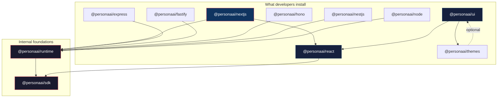

# Persona Package Ecosystem Plan

> *How many packages, what each one does, and in what order to build them.*

---

## What Exists Today

| Package | Location | Status | Purpose |
|---|---|---|---|
| `@personaai/sdk` | `sdk/typescript/` | **v0.4.2 — Shipped** | Raw TypeScript API client. Server-side only. Covers agents, threads, files, knowledge, MCP, providers, skills, audit logs, and AG-UI chat streaming. |
| `personaai` (Python) | `sdk/python/` | **v0.3.0 — Shipped** | Python API client. Sync + async. Same resource coverage as the TypeScript SDK. |
| `@personaai/runtime` | `sdk/runtime/` | **v0.5.1 — Shipped** | Framework-agnostic runtime engine. |
| `@personaai/react` | `sdk/react/` | **v0.3.2 — Shipped** | React hooks + context provider for client-side chat UIs. |
| `@personaai/ui` | `sdk/ui/` | **v0.7.3 — Shipped** | Pre-built React chat components. |
| `@personaai/express` | `sdk/adapters/express/` | **v0.1.0 — Shipped** | Express adapter. |
| `@personaai/nestjs` | `sdk/adapters/nestjs/` | **v0.1.0 — Shipped** | NestJS adapter. |
| Flutter app | `persona/` | **Exists** | Consumer mobile app. Not part of the package ecosystem. |

**Starting point:** We have the foundation layer (Level 1 — raw SDK) in two languages. Everything above it needs to be built.

---

## The Full Package Map



---

## Package-by-Package Breakdown

### 1. `@personaai/sdk` — The Foundation

> **Already exists.** This is Level 1 of the abstraction ladder.

| | |
|---|---|
| **Audience** | Developers who need full control, exotic runtimes, non-HTTP use cases |
| **Environment** | Server-side only (Node.js 18+) |
| **Depends on** | `@ag-ui/core` |
| **Used by** | `@personaai/runtime`, `@personaai/react` |
| **What it does** | Direct API client for every Persona capability — agents, threads, files, knowledge, MCP, providers, skills, chat streaming |
| **What changes** | Stays as-is. Remains the lowest layer. New capabilities surface here first, then propagate up. |

---

### 2. `@personaai/runtime` — The Engine

> **Shipped** (v0.5.1). This is the core of Level 2 — the "brain" that all framework adapters share.

| | |
|---|---|
| **Audience** | Not installed directly by developers (internal dependency) |
| **Environment** | Server-side, framework-agnostic |
| **Depends on** | `@personaai/sdk` |
| **Used by** | Every framework adapter (`nextjs`, `express`, `fastify`, `hono`, `nestjs`, `node`) |
| **What it does** | Framework-agnostic runtime engine. Receives a standard request context (method, path, headers, body, user identity) and produces a standard response. Handles all agent runtime concerns: AG-UI streaming, thread management, file uploads, memory, MCP OAuth callbacks, health checks, lifecycle hook orchestration. |
| **Why it's separate** | One codebase for all the runtime logic. Framework adapters are thin — they translate between their framework's request/response model and the runtime's standard context. When we add a capability to the runtime, every framework gets it automatically. |

**Key design:**
- The runtime receives a **resolved user identity**, not a raw request. Authentication has already happened.
- The runtime exposes lifecycle hook attachment points. Framework adapters pass hook configurations through.
- The runtime never imports Express, Fastify, Hono, or any framework. It speaks a neutral request/response contract.

---

### 3. `@personaai/nextjs` — The Hero Package

> **New.** Next.js-first, as the philosophy document dictates.

| | |
|---|---|
| **Audience** | Next.js developers (the primary audience) |
| **Environment** | Server-side (route handlers) + client-side (re-exports React package) |
| **Depends on** | `@personaai/runtime`, `@personaai/react` |
| **Used by** | Developers directly |
| **What it does** | Everything a Next.js developer needs in one package. Server-side: a route handler that mounts the runtime via App Router catch-all routes. Client-side: re-exports `@personaai/react` so the developer doesn't install two packages. |
| **Why it's combined** | Next.js is full-stack. A solo developer uses both the backend and frontend in the same project. Making them install two packages is unnecessary friction. `@personaai/nextjs` is the **only** package a Next.js developer installs. |

**What the developer does:**
1. Installs `@personaai/nextjs`
2. Creates one catch-all route file that exports the runtime handler
3. Wraps their layout in the provider (re-exported from this package)
4. Uses hooks or components

**That's it.**

---

### 4. `@personaai/express` — Express Adapter

> ✅ **Published** as `@personaai/express` v0.1.0 (issue #228) — docs: [Express Adapter guides](https://persona.hasanraiyan.me/guides/express/quickstart).
> Thin adapter.

| | |
|---|---|
| **Audience** | Express developers |
| **Environment** | Server-side only |
| **Depends on** | `@personaai/runtime` |
| **Used by** | Developers directly |
| **What it does** | Exposes the runtime as an Express Router. The developer mounts it with `app.use()`. Translates Express `req`/`res` into the runtime's standard context. |
| **Size** | Should be very small — just the adapter glue. All logic lives in `@personaai/runtime`. |

---

### 5. `@personaai/fastify` — Fastify Adapter

> **New.** Thin adapter.

| | |
|---|---|
| **Audience** | Fastify developers |
| **Environment** | Server-side only |
| **Depends on** | `@personaai/runtime` |
| **Used by** | Developers directly |
| **What it does** | Exposes the runtime as a Fastify plugin. The developer registers it with `fastify.register()`. Translates Fastify's request/reply into the runtime's standard context. |

---

### 6. `@personaai/hono` — Hono Adapter

> **New.** Thin adapter.

| | |
|---|---|
| **Audience** | Hono developers (also covers Cloudflare Workers, Bun, Deno) |
| **Environment** | Server-side only. Edge-compatible. |
| **Depends on** | `@personaai/runtime` |
| **Used by** | Developers directly |
| **What it does** | Exposes the runtime as a Hono route group. Translates Hono's `Context` into the runtime's standard context. |
| **Why it matters** | Hono is the rising edge-runtime framework. Supporting it means Persona works on Cloudflare Workers, Vercel Edge, Bun, and Deno — broadening the deployment surface significantly. |

---

### 7. `@personaai/nestjs` — NestJS Adapter

> **Shipped** (v0.1.0). Adapter using NestJS idioms.

| | |
|---|---|
| **Audience** | NestJS developers (enterprise, teams) |
| **Environment** | Server-side only |
| **Depends on** | `@personaai/runtime` |
| **Used by** | Developers directly |
| **What it does** | Exposes the runtime as a NestJS Dynamic Module. User resolver provided via a decorator or injectable service. Feels native to the NestJS dependency injection system. |
| **Why it's different** | NestJS has strong opinions about modules, decorators, and dependency injection. A simple router mount would feel foreign. This adapter speaks NestJS's language. |

---

### 8. `@personaai/node` — Raw Node.js Adapter

> **New.** Escape hatch.

| | |
|---|---|
| **Audience** | Developers using raw `http.createServer()` or any unlisted framework |
| **Environment** | Server-side only |
| **Depends on** | `@personaai/runtime` |
| **Used by** | Developers directly, or as a building block for community adapters |
| **What it does** | Exposes the runtime as a standard Node.js request handler `(req, res) => void`. Any framework that can call a function with a request and response can use this. |
| **Why it exists** | The escape hatch. If someone uses a framework we don't have an adapter for, they use this. It also validates that our runtime abstraction is truly framework-agnostic. |

---

### 9. `@personaai/react` — Hooks & State

> **Shipped** (v0.3.2). This is Level 3 of the abstraction ladder.

| | |
|---|---|
| **Audience** | Frontend developers building custom UIs for agent interactions |
| **Environment** | Client-side (React 18+) |
| **Depends on** | `@personaai/sdk` (for types + lightweight client calls to the runtime's HTTP surface) |
| **Used by** | Developers directly (when not using Next.js), `@personaai/nextjs` (re-exports), `@personaai/ui` |
| **What it does** | Provider component, all hooks, connection management, streaming state, reconnection logic. |

**What it includes:**
- `PersonaProvider` — Connection and configuration context
- `useChat` — Send messages, receive streaming responses, tool events
- `useThreads` — List, create, resume, delete conversations
- `useThread` — Single thread state and messages
- `useMemory` — Read agent/user memory
- `useFiles` — Upload files, track processing, attach to conversations
- `useAgents` — List available agents, read capabilities
- `useConnection` — Online/offline, reconnection state, health
- `usePersona` — Access the underlying SDK client for escape-hatch calls

**What it does NOT include:**
- No UI components (that's `@personaai/ui`)
- No styling (that's the developer's design system)
- No framework-specific server logic

---

### 10. `@personaai/ui` — UI Components

> **Shipped** (v0.7.3). This is Level 4 of the abstraction ladder.

| | |
|---|---|
| **Audience** | Developers who want pre-built, beautiful AI interfaces |
| **Environment** | Client-side (React 18+) |
| **Depends on** | `@personaai/react`, `@personaai/themes` |
| **Used by** | Developers directly |
| **What it does** | Production-ready, composable, themeable UI components for every agent interaction surface. |

**What it includes:**
- `<Chat />` — Full chat interface (messages, input, streaming, tool results)
- `<ThreadSidebar />` — Conversation list, search, create/delete
- `<AgentSelector />` — Agent cards, capability preview, switching
- `<ToolExecution />` — Tool call progress, results, errors
- `<FileAttachment />` — Drag-drop upload, preview, processing status
- `<MemoryPanel />` — What the agent remembers, editable
- `<Workspace />` — The full composed experience (Phase 3 from the philosophy doc)

**Design principles:**
- Every component works independently — use `<Chat />` without `<ThreadSidebar />`
- Every component is composable — combine them in any layout
- Every component is themeable via `@personaai/themes` or custom CSS
- Every component uses hooks internally — if you outgrow a component, grab the hook and build your own

---

### 11. `@personaai/themes` — Theme System

> **New.** Design tokens and presets.

| | |
|---|---|
| **Audience** | Developers using `@personaai/ui` who want to customize appearance |
| **Environment** | Client-side |
| **Depends on** | Nothing |
| **Used by** | `@personaai/ui` |
| **What it does** | CSS custom properties, design tokens, and pre-built themes. Ships a default theme that looks beautiful. Provides utilities for creating custom themes that match the host application's brand. |

**Why it's separate:** Themes are optional. A developer using hooks only (`@personaai/react`) never downloads theme CSS. A developer who wants the UI components but with their own design system can swap themes without touching component code.

---

## The Dependency Graph (Summary)

```
Developer installs          Pulls in automatically
──────────────────          ──────────────────────

@personaai/nextjs     →     @personaai/runtime → @personaai/sdk
                      →     @personaai/react   → @personaai/sdk

@personaai/express    →     @personaai/runtime → @personaai/sdk

@personaai/fastify    →     @personaai/runtime → @personaai/sdk

@personaai/hono       →     @personaai/runtime → @personaai/sdk

@personaai/nestjs     →     @personaai/runtime → @personaai/sdk

@personaai/node       →     @personaai/runtime → @personaai/sdk

@personaai/react      →     @personaai/sdk

@personaai/ui         →     @personaai/react   → @personaai/sdk
                      →     @personaai/themes

@personaai/themes     →     (nothing)
```

---

## What the Developer Actually Installs

Most developers install **one or two packages**. Never more.

| Scenario | Installs | Total packages |
|---|---|---|
| **Next.js full-stack (most common)** | `@personaai/nextjs` | **1** |
| **Next.js + pre-built UI** | `@personaai/nextjs` + `@personaai/ui` | **2** |
| **Express + React frontend** | `@personaai/express` + `@personaai/react` | **2** |
| **Express + pre-built UI** | `@personaai/express` + `@personaai/ui` | **2** |
| **Hono API + no frontend** | `@personaai/hono` | **1** |
| **Raw SDK (power users)** | `@personaai/sdk` | **1** |
| **Custom framework** | `@personaai/node` + `@personaai/react` | **2** |

**The rule: the most common path (Next.js) requires exactly one install.**

---

## Build Order — Four Waves

### Wave 1 — The Foundation (Build First)

| Package | Why first |
|---|---|
| `@personaai/runtime` | Everything depends on this. It's the product. |
| `@personaai/react` | The frontend foundation. Hooks come before UI. |

These two packages define the runtime contract and the frontend contract. Everything else is an adapter or an extension.

### Wave 2 — The Hero Path (Next.js First)

| Package | Why second |
|---|---|
| `@personaai/nextjs` | The primary user path. The one we demo. The one in the docs. |
| `@personaai/node` | The escape hatch. Validates the runtime abstraction is truly framework-agnostic. |

After Wave 2, a Next.js developer can go from install to streaming conversation. The core promise is deliverable.

### Wave 3 — Framework Expansion

| Package | Why third |
|---|---|
| `@personaai/express` | Second largest audience. Many existing backends. |
| `@personaai/hono` | Rising fast. Edge runtime support. |
| `@personaai/fastify` | Strong ecosystem. Performance-focused teams. |

These are thin adapters over `@personaai/runtime`. If the runtime is solid from Wave 1, these should be fast to build.

✅ **`@personaai/express` is shipped** (v0.1.0 published);
✅ **`@personaai/nestjs` is shipped** (v0.1.0 published);
`@personaai/hono` and `@personaai/fastify` remain.

### Wave 4 — The Experience Layer

| Package | Why last |
|---|---|
| `@personaai/ui` | ✅ **Shipped** (v0.7.3). |
| `@personaai/themes` | Not yet started — genuinely still future work. |
| `@personaai/nestjs` | ✅ **Shipped** (v0.1.0). |

`@personaai/ui` shipped with its own inline theming system (`PersonaCustomTheme` + CSS custom properties) rather than a separate `@personaai/themes` package — the themes package may still be useful for sharing presets across projects, but is not required for UI components to work.

---

## Python Ecosystem

The Python SDK (`personaai`) already exists as the Level 1 equivalent. The Python ecosystem follows a parallel but smaller structure:

| Python Package | Equivalent JS Package | Priority |
|---|---|---|
| `personaai` (exists) | `@personaai/sdk` | ✅ Done |
| `personaai-runtime` | `@personaai/runtime` | Future — when Python web frameworks are a priority |
| `personaai-fastapi` | `@personaai/express` (conceptually) | Future — FastAPI is the hero framework for Python |
| `personaai-django` | `@personaai/nestjs` (conceptually) | Future — Django for enterprise Python |

**For now, Python stays at Level 1 (SDK only).** The runtime layer strategy is JavaScript-first because that's where Next.js, the hero framework, lives.

---

## What NOT to Build

| Don't build this | Why |
|---|---|
| `@personaai/vue` | Wait for demand. React is the priority. Vue hooks can come later if there's pull. |
| `@personaai/svelte` | Same as Vue. Wait for demand. |
| `@personaai/angular` | Same. Angular developers who need it can use `@personaai/sdk` directly. |
| `@personaai/cli` | A CLI is a different product surface. If needed, it's a separate initiative, not part of the runtime ecosystem. |
| `@personaai/config` | No config package. Configuration lives in each framework adapter. No ceremony. |
| `@personaai/types` | Types ship with each package. No standalone types package — that creates versioning headaches. |
| `@personaai/core` | Tempting but wrong. "Core" packages become dumping grounds. The runtime IS the core. |
| `@personaai/utils` | Internal utilities live inside the packages that use them. No shared utility package. |

---

## Final Count

| Category | Packages | Names |
|---|---|---|
| **Foundation** | 2 | `sdk`, `runtime` |
| **Framework adapters** | 5 | `nextjs`, `express`, `fastify`, `hono`, `nestjs` |
| **Escape hatch** | 1 | `node` |
| **Frontend** | 2 | `react`, `ui` |
| **Theming** | 1 | `themes` |
| **Total** | **11** | |

Plus 1 existing Python SDK.

**11 JavaScript packages. That's the ecosystem.**

```
@personaai/sdk          ← Shipped (v0.4.2)
@personaai/runtime      ← Shipped (v0.5.1)
@personaai/react        ← Shipped (v0.3.2)
@personaai/nextjs       ← New (Wave 2)
@personaai/node         ← New (Wave 2)
@personaai/express      ← Shipped (v0.1.0)
@personaai/hono         ← New (Wave 3)
@personaai/fastify      ← New (Wave 3)
@personaai/ui           ← Shipped (v0.7.3)
@personaai/themes       ← New (future)
@personaai/nestjs       ← Shipped (v0.1.0)
```
