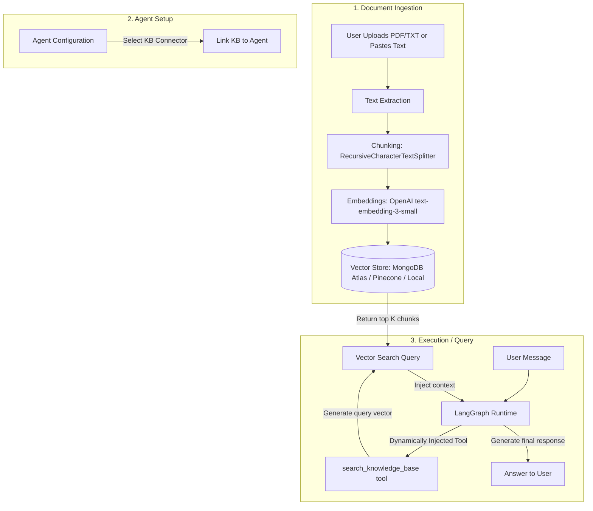

# Research & Architecture: Agent Knowledge Base Connectors

This document analyzes how leading AI platforms (ChatGPT, Claude Projects, and Gemini/NotebookLM) implement document-based knowledge bases (RAG) and proposes a concrete implementation plan for adding a **Knowledge Base Connector** to **Persona.ai**.

---

## 1. How Existing Platforms Implement Knowledge Bases

### A. ChatGPT (Custom GPTs / OpenAI Assistants API)
*   **Mechanism**: OpenAI uses **Vector Stores** via their **File Search** tool (formerly Retrieval).
*   **Workflow**:
    1. A user uploads files (PDF, TXT, DOCX, etc.) to the Custom GPT.
    2. OpenAI automatically parses, chunks, embeds (using `text-embedding-3-small` or similar), and stores the text in a vector database behind the scenes.
    3. During the chat session, OpenAI's model dynamically decides when to call the `file_search` tool based on the user's query.
    4. The tool returns matching text chunks, and the model synthesizes a response with footnotes citing the file.

### B. Claude Projects (Anthropic)
*   **Mechanism**: Project Knowledge Base with hybrid scaling.
*   **Workflow**:
    1. Users upload documents directly into a "Project".
    2. Anthropic takes advantage of Claude's massive context window (200k+ tokens). If the documents are small enough, they are fed **directly into the context window** as system documents.
    3. If the document volume grows too large, Claude transitions to a semantic retrieval mechanism (RAG), querying an indexed search and injecting only the relevant segments.

### C. Gemini Gems & NotebookLM (Google)
*   **Mechanism**: NotebookLM uses dedicated source indexing with Gemini's long context.
*   **Workflow**:
    1. Users add sources (Google Docs, Google Slides, PDFs, text, YouTube links).
    2. NotebookLM builds a semantic index. Because of Gemini 1.5's massive context window (up to 2 million tokens), it can read all the sources simultaneously in a single session rather than relying strictly on keyword chunking, resulting in highly unified synthesis and summaries.

---

## 2. Proposed Architecture for Persona.ai

To keep our architecture modular and cost-effective, we will treat the **Knowledge Base** as a new **Connector Type** (parallel to *Skills* and *MCP Servers*).

---

## 3. Core Components

### A. Data Ingestion & Chunking
When a user uploads a PDF/TXT or pastes text:
1.  **Parsing**: Extract text content on the backend (e.g. using `pdf-parse` for PDFs).
2.  **Chunking**: Split text into semantic chunks of ~500–1000 characters with a 100-character overlap (e.g., using a recursive text splitter) to preserve context.
3.  **Embeddings**: Send chunks to the OpenAI Embedding API (or the configured user's provider) to get 1536-dimensional vectors.
4.  **Storage**: Store the chunks and their vectors.

### B. Vector Database Choice
For our MVP/production database, we can leverage:
*   **MongoDB Atlas Vector Search**: Since our backend already runs on MongoDB, we can define a vector index on our collections. This avoids introducing a new database dependency (like Pinecone or Qdrant) and allows us to perform cosine similarity searches directly inside MongoDB using `$vectorSearch` in aggregation pipelines.

### C. Agent Integration (Dynamic Tool Injection)
1.  When loading an agent via `agentFactory.js`, we check if it has any associated **Knowledge Base Connectors**.
2.  If it does, we dynamically instantiate a LangChain tool called `search_knowledge_base_<kb_name>` and add it to the agent's toolbelt:
    *   **Description**: *"Search this knowledge base containing documents about [KB Description]. Use this tool to retrieve relevant context before answering questions on this topic."*
    *   **Input**: A query string.
    *   **Action**: Generate query embedding -> Query vector store -> Return matching text chunks.
3.  The agent automatically calls this tool when asked about topics covered in the knowledge base, returning grounded answers with citations.

---

## 4. Implementation Steps

We will implement this in the following phases:
1.  **Model Schemas**: Create `KnowledgeBase.js` and `KnowledgeChunk.js` models.
2.  **Ingestion Service**: Create `services/knowledge.service.js` for text extraction, chunking, and embedding generation.
3.  **API Endpoints**: Add routes for creating, listing, uploading files, and deleting knowledge bases.
4.  **Form & UI**: Add a "Knowledge Base" configuration section in the Agent Form and a dashboard section to manage documents.
5.  **Runtime Integration**: Update the backend agent compiler to load and convert associated Knowledge Bases into executable LangChain tools.
